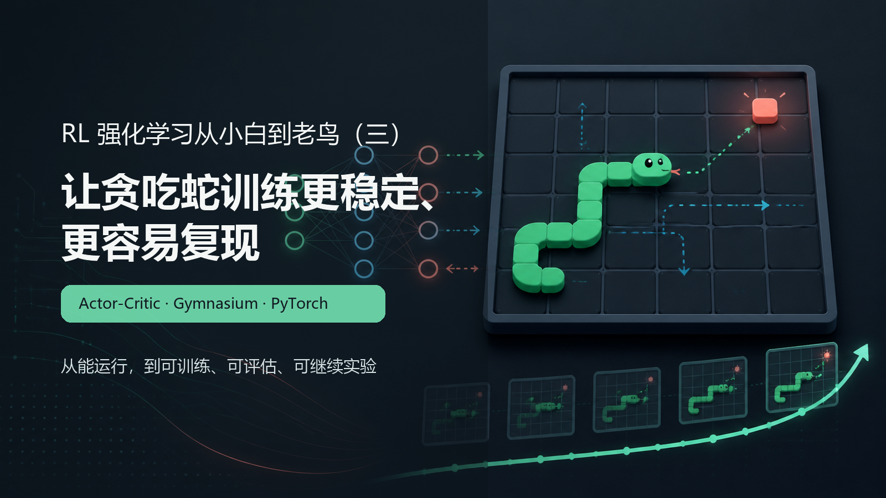
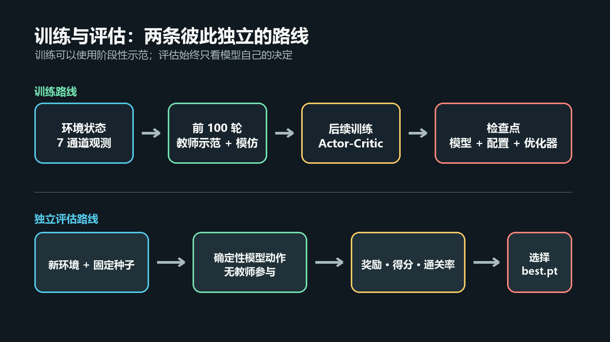
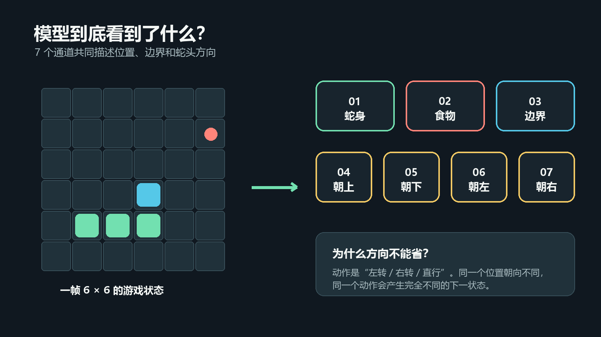
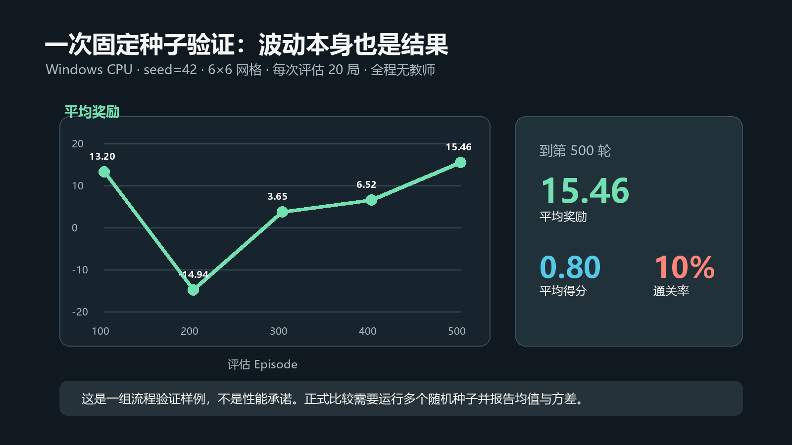

# RL强化学习从小白到老鸟（三）——让贪吃蛇训练更稳定、更容易复现

> 项目源码：<https://github.com/NocoldBob/RL>
>
> 系列第一篇：[速通贪吃蛇游戏](https://blog.csdn.net/bobwww123/article/details/138722671)
>
> 系列第二篇：[手撕 GPT（零基础保姆级教学）](https://blog.csdn.net/bobwww123/article/details/138948884)



## 前言：两年后，我把这个入门项目重新跑了一遍

2024 年写第一篇贪吃蛇教程时，目标很明确：不要一上来就堆公式和算力，先让新人亲手跑通
“环境给状态、模型选动作、奖励推动学习”这个闭环。用一个很小的卷积网络，普通电脑也能
看到蛇动起来，这仍然是这个项目最重要的教学价值。

最近我把旧项目迁移到新的开发环境，顺手用现在的 PyTorch、Gymnasium 和自动测试重新跑了
一遍。代码依然不大，但我开始关注一些当年没有展开讲的工程问题：

- 模型选择的动作，环境是否真的执行了？
- 启发式规则退出后，模型自己还能不能走？
- 状态里有没有包含做决定所需的全部信息？
- 一次漂亮的游戏画面，能不能代表训练效果？
- 换一台电脑，别人能不能复现实验？

所以第三篇继续沿着原来的贪吃蛇向前走，也不急着换更大的模型：我们把一个“能运行”的
教学项目升级成“可训练、可评估、可继续实验”的项目。

## 一、这次升级了哪些地方

| 主题 | 入门阶段的做法 | 当前版本 |
|---|---|---|
| 算法定位 | 从 SAC 和 Actor-Critic 思想切入 | 将代码准确定位为轻量单步 Actor-Critic |
| 动作执行 | 启发式逻辑参与动作选择 | 环境严格执行传入动作，教师策略单独调用 |
| 新手引导 | 规则帮助模型尽快看到正奖励 | 显式教师示范 + 小型行为克隆回放 |
| 状态表示 | 蛇身、食物、边界 | 再加入四个蛇头方向通道 |
| 环境接口 | Gym 的 `done` 接口 | Gymnasium 的 `terminated` / `truncated` |
| 效果判断 | 训练奖励和运行画面 | 独立环境中的奖励、得分和通关率 |
| 工程能力 | 手动保存模型 | 固定种子、检查点、TensorBoard、自动测试和 CI |

网络仍然很小，CPU 也能训练。变化主要不在“堆模型”，而在实验过程变得更清楚。

## 二、先把算法的名字和代码对应起来

第一篇从 SAC（Soft Actor-Critic）切入介绍了 Actor、Critic 和熵探索。当前代码真正实现的
主体是：一个 Actor 输出离散动作概率，一个 Critic 估计状态价值 `V(s)`，每走一步进行一次
TD 更新。为了让名称和代码一一对应，最新版统一称为：

**带卷积编码器的单步 Actor-Critic。**

它和 SAC 都属于 Actor-Critic 家族，但完整 SAC 通常还包括双 Q 网络、目标网络、经验回放、
温度参数等组件，而且更常见于连续动作任务。贪吃蛇只有“左转、右转、直行”三个离散动作，
先用轻量 Actor-Critic 把策略和值函数讲清楚，反而更适合入门。

这也是做教学项目时很常见的一次演进：先借助大框架建立直觉，再逐步把每个概念和实现边界
标得更准确。

## 三、训练和评估为什么要分开



新版把整个流程分成两条路线。

### 训练路线

前 100 个 Episode 可以让启发式教师提供示范，帮助小模型先学会基本转向；教师阶段结束后，
模型完全依靠 Actor-Critic 自己探索。模型参数、优化器状态、训练轮次和环境配置一起保存在
检查点中，方便中断后继续训练。

### 独立评估路线

评估会创建一个新的环境，使用固定种子和确定性动作，并且不调用教师策略。只有这条路线的
成绩才用于选择 `best.pt`。

训练奖励回答的是“训练过程发生了什么”，独立评估回答的是“现在这个模型自己会什么”。
两者都值得看，但不能混在一起。

## 四、环境只做一件事：执行传入的动作

强化学习里有一条很朴素的因果关系：

```text
状态 s --模型选择动作 a--> 环境执行 a --得到--> 奖励 r 和下一状态 s'
```

如果 `env.step(action)` 收到模型动作后，又在内部换成另一个动作，训练程序就很难判断奖励
究竟由谁产生。新版给环境定了一条简单规则：

> 传入什么动作，环境就执行什么动作。

每一步还会返回实际动作，便于测试：

```python
observation, reward, terminated, truncated, info = env.step(action)
assert info["executed_action"] == action
```

这不是为了增加代码量，而是为了让“动作导致结果”这件事始终可追踪。

## 五、保留老师带路，但把它变成显式示范

第一版的启发式规则非常有教学价值：新人不必等待很久，就能看到蛇开始寻找食物。新版没有
删除这条思路，而是把它从环境内部移到了训练程序里：

```python
teacher_action = env.teacher_action()
next_observation, reward, terminated, truncated, info = env.step(teacher_action)
```

示范样本会进入一个小型回放集合，Actor 用交叉熵学习教师动作，Critic 学习这段轨迹的价值。
这个阶段可以准确地称为**行为克隆（Behavior Cloning）**。

教师阶段结束后，动作切换为模型采样：

```python
action = agent.predict(state)
next_observation, reward, terminated, truncated, info = env.step(action)
agent.update(state, action, reward, next_state, done, gamma)
```

这样既保留了低算力快速入门的优势，也能清楚区分“老师演示”和“智能体自主学习”。想观察
完全从零探索的效果，只需要把教师轮数设为 0：

```powershell
python .\贪吃蛇\main.py --teacher-episodes 0
```

## 六、一个容易忽略的状态信息：蛇头方向



项目里的三个动作是相对方向：左转、右转、直行，而不是绝对的上、下、左、右。

假设蛇头都在地图中央：一条蛇朝上，另一条蛇朝右。它们选择“左转”后到达的位置完全不同。
如果观测里只有蛇头位置，模型就无法区分这两个状态。

新版观测因此使用七个通道：

1. 蛇身；
2. 食物；
3. 边界；
4. 朝上；
5. 朝下；
6. 朝左；
7. 朝右。

四个方向通道使用 one-hot 表示。这个改动不会显著增加计算量，却让当前状态足以解释相对
动作的含义。

## 七、Actor-Critic 到底更新了什么

模型仍然采用一个共享卷积编码器，再分成两个输出头：

```python
self.feature_extractor = nn.Sequential(
    nn.Conv2d(input_channels, 16, kernel_size=3, padding=1),
    nn.ReLU(),
    nn.Flatten(),
)
self.actor = nn.Linear(feature_dim, output_dim)
self.critic = nn.Linear(feature_dim, 1)
```

Actor 输出三个动作的 logits，Critic 输出当前状态价值 `V(s)`。TD 目标可以简化理解为：

```text
target = reward + gamma * V(next_state)
advantage = target - V(state)
```

`advantage` 为正，说明这次动作结果比 Critic 原先预期得更好；Actor 会提高这个动作的概率。
反之则降低概率。Critic 同时缩小自己预测值和 TD 目标之间的差距。

终止状态不再叠加下一状态价值，TD 目标也不会向 `next_state` 反向传播：

```python
with torch.no_grad():
    _, next_value = self(next_state)
    target = reward if done else reward + gamma * next_value
```

损失中保留少量熵奖励，防止模型过早只选择一个动作。这里的熵是探索辅助，不改变该实现的
轻量 Actor-Critic 定位。

## 八、迁移到 Gymnasium

Gymnasium 是 Gym API 的维护中继任者。新版接口将结束拆成两类：

```python
observation, reward, terminated, truncated, info = env.step(action)
done = terminated or truncated
```

- `terminated`：撞墙、撞到自己或达到任务目标；
- `truncated`：达到最大步数等外部限制。

`reset` 也会返回观测和附加信息：

```python
observation, info = env.reset(seed=42)
```

环境目前可以通过 Gymnasium 官方检查器，自动测试还覆盖了固定种子、动作执行、教师寻路、
状态通道和最大步数截断。

## 九、一次真实验证：不要害怕曲线波动



发布前，我在 Windows CPU 上用 `seed=42`、`6×6` 网格训练了 500 个 Episode。每隔 100 轮，
在新的环境中进行 20 局无教师评估。

| 训练轮数 | 平均奖励 | 平均得分 | 通关率 |
|---:|---:|---:|---:|
| 100 | 13.20 | 0.60 | 10% |
| 200 | -14.94 | 0.20 | 0% |
| 300 | 3.65 | 0.50 | 5% |
| 400 | 6.52 | 0.75 | 5% |
| 500 | 15.46 | 0.80 | 10% |

第 200 轮出现了明显回落，后面又逐渐恢复。这恰好说明强化学习不是一条平滑上升的直线。
一次成功动画或一个随机种子都不能代表算法上限。

这组数据的用途是证明训练、保存和独立评估链路已经跑通，不是性能承诺。正式做算法比较时，
至少应该运行多个随机种子，再报告平均值和方差。

## 十、从零开始运行

### 1. 获取代码

```powershell
git clone https://github.com/NocoldBob/RL.git
cd RL
```

### 2. 创建环境

```powershell
py -3.12 -m venv .venv
.\.venv\Scripts\Activate.ps1
python -m pip install -r requirements.txt
```

Linux 或 macOS 激活环境：

```bash
source .venv/bin/activate
```

### 3. 先运行一次流程检查

```powershell
python .\贪吃蛇\main.py --episodes 20 --teacher-episodes 5 --grid-size 6 `
  --end-score 4 --max-steps 100 --eval-interval 10 --eval-episodes 3
```

这条命令不是为了训练出高分模型，而是快速确认环境、训练、评估、日志和检查点都能工作。

### 4. 运行默认教学实验

```powershell
python .\贪吃蛇\main.py
```

默认使用 `6×6` 网格训练 500 个 Episode，前 100 个 Episode 使用教师示范。结果保存在
`runs/snake`。

### 5. 查看 TensorBoard

```powershell
tensorboard --logdir .\runs\snake\tensorboard
```

浏览器打开命令提示的网址后，重点观察：

- `train/reward`：训练过程的奖励；
- `train/score`：每轮吃到的食物；
- `eval/reward`：无教师独立评估奖励；
- `eval/score`：无教师独立评估得分；
- `train/actor_loss` 和 `train/critic_loss`：两个网络头的更新情况。

### 6. 播放模型

```powershell
python .\贪吃蛇\play.py .\runs\snake\checkpoints\best.pt --fps 15
```

播放程序会从检查点恢复网格等配置，使用确定性模型动作，并且不会调用教师策略。

## 十一、推荐做的三个对照实验

读到这里，不妨亲手改变一个变量。比单独追求高分更有学习价值。

### 实验 A：完全自主探索

```powershell
python .\贪吃蛇\main.py --teacher-episodes 0 --output-dir runs\no-teacher
```

### 实验 B：先看教师示范

```powershell
python .\贪吃蛇\main.py --teacher-episodes 100 --output-dir runs\with-teacher
```

### 实验 C：更换随机种子

```powershell
python .\贪吃蛇\main.py --seed 7 --output-dir runs\seed-7
python .\贪吃蛇\main.py --seed 2026 --output-dir runs\seed-2026
```

然后统一打开：

```powershell
tensorboard --logdir .\runs
```

比较教师退出后的评估曲线、最终得分和不同种子的波动。你会发现，强化学习真正有意思的地方，
往往不在“某一次成功”，而在不同设置为什么产生不同结果。

## 十二、写在最后

第一篇完成了最重要的一步：让一个强化学习项目在低算力设备上真正动起来。第三篇是在这个
基础上继续向前，把动作、状态、教师示范和独立评估之间的关系说明白。

项目不一定要很大才值得长期维护。只要它能让后来者少踩一个坑、多建立一个正确直觉，它就
仍然有价值。

下一步准备给贪吃蛇加入随机策略、启发式策略和 DQN 三个基线，再用多个随机种子比较样本
效率、最终得分和 CPU 时间。到那时，我们就不只是问“它会不会玩”，而是开始问“哪种学习
方法更适合这个问题”。

---

项目地址：<https://github.com/NocoldBob/RL>

建议标签：`强化学习`、`Actor-Critic`、`Gymnasium`、`PyTorch`、`贪吃蛇`、`行为克隆`、
`深度学习`、`人工智能`
