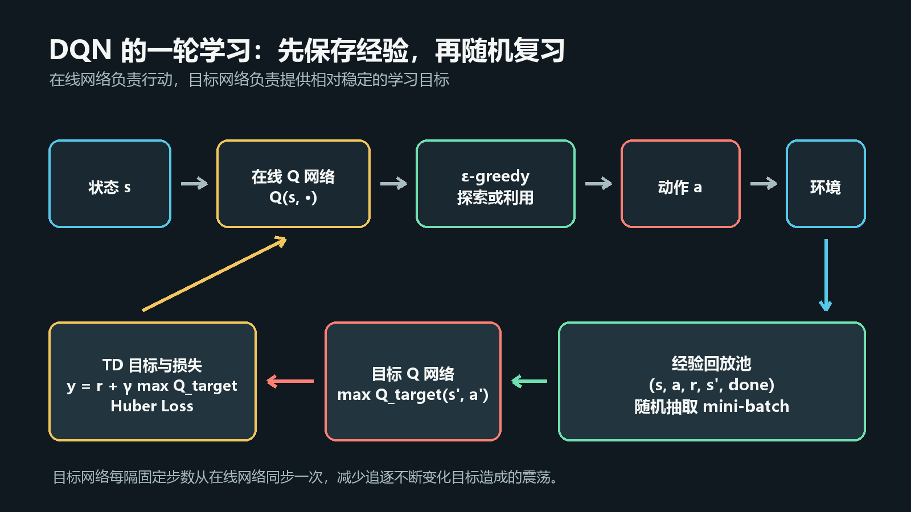
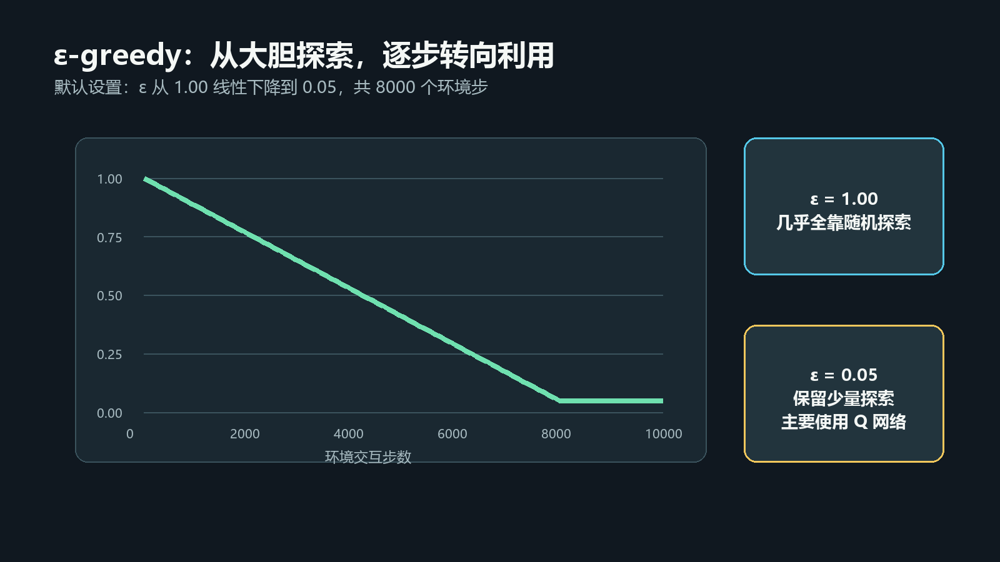
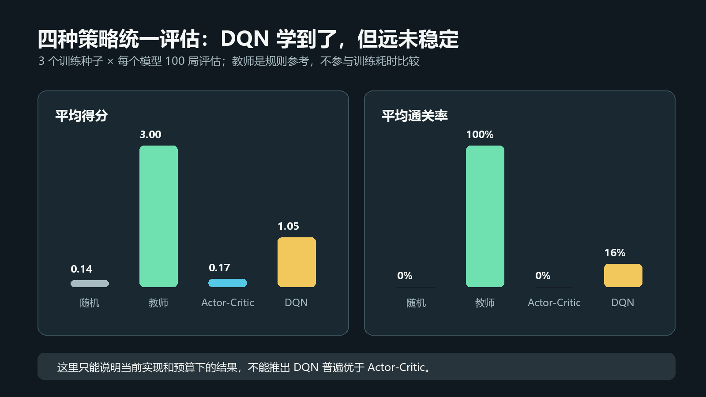
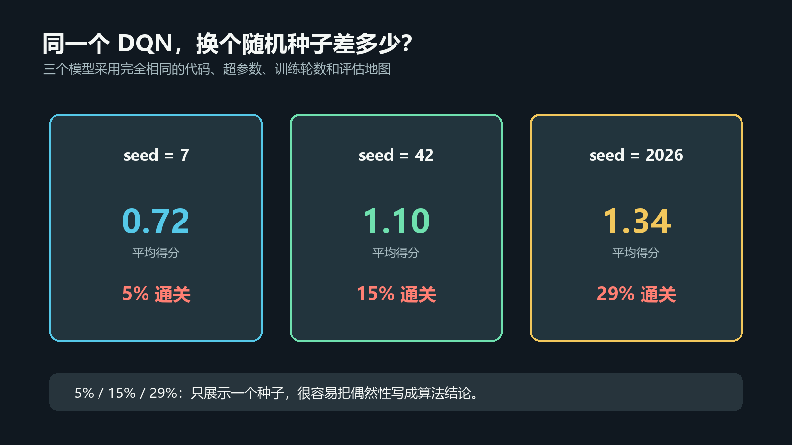

# RL强化学习从小白到老鸟（四）——DQN实战：四种策略同场对照

> 项目源码：<https://github.com/NocoldBob/RL>
>
> 第一篇：[速通贪吃蛇游戏](https://blog.csdn.net/bobwww123/article/details/138722671)
>
> 第二篇：[手撕 GPT（零基础保姆级教学）](https://blog.csdn.net/bobwww123/article/details/138948884)
>
> 第三篇：[让贪吃蛇训练更稳定、更容易复现](03-让贪吃蛇训练更稳定更容易复现.md)


## 前言：这次不只问“会不会玩”

前三篇把贪吃蛇环境、轻量 Actor-Critic、教师示范和独立评估跑通了。第三篇结尾留了一个
问题：如果换一种学习方法，结果会怎样？

贪吃蛇的动作只有三个：左转、右转、直行。这是一个很适合 DQN 的离散动作任务。于是这次
增加一套完整的 DQN，并把四种策略放进同一个评估程序：

1. 随机策略；
2. 启发式教师；
3. 不使用教师的轻量 Actor-Critic；
4. DQN。

这次不挑一段最好看的动画，也不只跑一个随机种子。我们训练三个模型种子，每个模型最终
在相同的 100 局地图上评估，然后把波动一起写出来。

先说结论：DQN 确实学到了东西，但它远没有稳定到“轻松通关”。这反而比一张完美曲线更适合
教学。

## 一、DQN 学的是什么

Actor-Critic 的 Actor 直接学习“这个状态下应该以多大概率选择每个动作”。DQN 换了一个
角度，它学习动作价值：

```text
Q(s, a) = 在状态 s 选择动作 a 后，未来累计回报的估计值
```

当前状态输入网络后，DQN 输出三个数：

```text
Q(左转), Q(右转), Q(直行)
```

不探索时，选择 Q 值最大的动作：

```python
action = q_values.argmax(dim=1)
```

我们不再需要为每一个地图状态建立一张巨大的 Q 表。卷积网络负责从七通道地图中提取特征，
再估计三个动作的价值。

## 二、DQN 的三个关键组件



只使用一个神经网络，每走一步就立刻拿这一步训练，很容易出现样本相关性和目标不断变化的
问题。DQN 用三个组件让训练更稳定。

### 1. 经验回放池

每一步交互保存为一个五元组：

```text
(state, action, reward, next_state, done)
```

训练时不只看最新一步，而是从历史经验中随机抽取 mini-batch：

```python
replay.append(state, action, reward, next_state, done)
batch = replay.sample(batch_size=64, device=device)
```

随机回放打散了相邻样本，让一次更新能够同时看到不同地图、不同位置和不同阶段的经验。

项目中的回放池会复制 NumPy 观测，避免环境后续修改数据时污染历史样本；随机抽样器也使用
固定种子，方便复现实验。

### 2. 目标网络

DQN 同时保留两个结构相同的网络：

- 在线网络 `online`：负责选动作和被梯度更新；
- 目标网络 `target`：负责计算相对稳定的 TD 目标。

目标网络不会每一步都跟着变化，而是每隔固定环境步数同步一次：

```python
if total_steps % target_update_interval == 0:
    agent.sync_target()
```

这相当于给学习目标按下短暂的“暂停键”。在线网络可以朝一个暂时固定的目标学习，而不是
一边追目标，目标又一边移动。

### 3. ε-greedy 探索



如果模型从第一步开始只选择当前 Q 值最大的动作，它很可能因为随机初始化而固守一条很差的
路线。ε-greedy 用一个简单概率决定是否随机探索：

```python
if random_source.random() < epsilon:
    return random_source.randrange(action_count)
return q_values.argmax(dim=1)
```

默认配置中，`epsilon` 在 8000 个环境交互步内从 `1.00` 线性下降到 `0.05`：

- 训练初期主要随机探索；
- 中期逐渐相信 Q 网络；
- 后期仍保留 5% 的随机动作，避免完全失去探索。

评估和播放模型时会把 `epsilon` 设为 0，成绩只来自网络本身。

## 三、网络和 TD 目标

为了继续保持低算力路线，Q 网络仍然很小：

```python
self.network = nn.Sequential(
    nn.Conv2d(input_channels, 16, kernel_size=3, padding=1),
    nn.ReLU(),
    nn.Flatten(),
    nn.Linear(16 * grid_size * grid_size, 64),
    nn.ReLU(),
    nn.Linear(64, action_count),
)
```

训练时，只取本次实际动作对应的 Q 值：

```python
q_values = online(states)
selected_q = q_values.gather(1, actions.unsqueeze(1)).squeeze(1)
```

目标值由奖励和下一状态的最大目标 Q 值组成：

```text
y = reward + gamma * (1 - done) * max Q_target(next_state, action)
```

对应代码：

```python
with torch.no_grad():
    next_q = target(next_states).max(dim=1).values
    y = rewards + gamma * (1.0 - dones) * next_q
```

损失使用 Huber Loss：

```python
loss = F.smooth_l1_loss(selected_q, y)
```

它在误差较小时接近平方误差，在误差很大时增长更温和，适合奖励偶尔突然跳高的贪吃蛇任务。

## 四、从零训练一个 DQN

### 1. 获取并安装项目

```powershell
git clone https://github.com/NocoldBob/RL.git
cd RL
py -3.12 -m venv .venv
.\.venv\Scripts\Activate.ps1
python -m pip install -r requirements.txt
```

### 2. 先跑一个短流程

```powershell
python .\贪吃蛇\train_dqn.py --episodes 50 --eval-interval 25 `
  --eval-episodes 5 --output-dir runs\dqn-smoke
```

这条命令只检查环境、回放、网络更新、评估和检查点能否工作，不代表模型已经收敛。

### 3. 运行默认训练

```powershell
python .\贪吃蛇\train_dqn.py
```

默认配置：

| 参数 | 默认值 | 作用 |
|---|---:|---|
| `episodes` | 1000 | 训练轮数 |
| `replay_capacity` | 20000 | 最大历史经验数 |
| `batch_size` | 64 | 每次随机回放数量 |
| `learning_starts` | 250 | 至少收集多少步后开始更新 |
| `train_interval` | 4 | 每隔多少环境步更新一次 |
| `target_update_interval` | 250 | 目标网络同步间隔 |
| `epsilon_decay_steps` | 8000 | 探索率下降周期 |
| `torch_threads` | 1 | 小网络 CPU 训练线程数 |

训练结果保存在 `runs/dqn`：

```text
runs/dqn/
  checkpoints/best.pt
  checkpoints/latest.pt
  history.json
  summary.json
  tensorboard/
```

### 4. 查看 TensorBoard

```powershell
tensorboard --logdir .\runs\dqn\tensorboard
```

重点观察 `train/reward`、`train/score`、`train/loss`、`train/q_mean` 和
`train/epsilon`。奖励曲线波动很大是正常现象，最好同时看独立评估指标。

### 5. 播放模型

```powershell
python .\贪吃蛇\play_dqn.py .\runs\dqn\checkpoints\best.pt --fps 15
```

播放使用确定性动作，`epsilon=0`，也不会调用教师策略。

## 五、四种策略怎样统一评估

本次基准设置为：

- 地图：`6×6`；
- 通关目标：吃到 3 个食物，使蛇长度达到 4；
- 每局最多 100 步；
- Actor-Critic 与 DQN 都训练 1000 个 Episode；
- 训练种子：`7、42、2026`；
- 每个训练结果在同样的 100 局地图上评估；
- 评估使用确定性模型动作，不使用教师；
- Windows CPU，PyTorch 使用一个计算线程。

运行完整基准：

```powershell
python .\贪吃蛇\benchmark.py --seeds 7 42 2026 --episodes 1000 `
  --eval-episodes 100 --device cpu --torch-threads 1
```

已经完成训练时，可以复用检查点：

```powershell
python .\贪吃蛇\benchmark.py --reuse
```

结果同时写入 `results.json` 和方便表格软件打开的 `results.csv`。

这里需要说明“统一”的边界：两个学习算法使用相同 Episode 数和最大步数，但由于撞墙时间
不同，实际环境交互步数不会完全相同。因此这是教学用的统一规则对照，不是严格的样本效率
论文实验。教师策略是规则参考，也不是经过 1000 个 Episode 训练出来的参赛模型。

## 六、实测结果



三随机种子的聚合结果如下。`±` 后面是三个训练种子之间的总体标准差。

| 策略 | 平均奖励 | 平均得分 | 平均通关率 | 平均训练时间 |
|---|---:|---:|---:|---:|
| 随机 | `-2.27 ± 0.27` | `0.14 ± 0.02` | `0%` | 无训练 |
| 启发式教师 | `134.31 ± 0.00` | `3.00 ± 0.00` | `100%` | 规则策略 |
| 轻量 Actor-Critic | `-26.64 ± 7.25` | `0.17 ± 0.10` | `0%` | `35.2 秒` |
| DQN | `25.33 ± 21.56` | `1.05 ± 0.26` | `16.3% ± 9.8%` | `29.2 秒` |

原始结果保存在仓库的 `docs/experiments/04-dqn-benchmark.json`，可以直接核对每一个种子。

### 怎么理解这张表

**随机策略**提供最低参考。它偶尔会碰巧吃到食物，但 300 局评估中没有通关。

**启发式教师**在当前小地图上达到 100% 通关。它使用已知规则、安全搜索和食物距离，不是
从奖励中学出来的，所以它更像“参考答案”，不能和学习算法直接比较样本效率。

**当前轻量 Actor-Critic**在训练中偶尔能得到高分，但最后一个检查点的确定性策略发生了
退化，最终评估接近随机。这只能说明当前网络、单步更新方式和训练预算下不稳定，不能推导出
“Actor-Critic 算法不如 DQN”。更完整的 A2C、PPO 可能得到完全不同的结果。

**DQN**明显学到了寻找食物和延长生存的策略，平均得分超过 1，但平均通关率只有 16.3%。
它赢过了当前两个学习基线，却远没有追上教师规则。

## 七、为什么不能只展示 seed=2026



同一个 DQN，代码和超参数完全不变，只修改随机种子：

| 种子 | 平均奖励 | 平均得分 | 通关率 |
|---:|---:|---:|---:|
| 7 | -3.25 | 0.72 | 5% |
| 42 | 30.42 | 1.10 | 15% |
| 2026 | 48.83 | 1.34 | 29% |

如果只展示 `seed=2026`，可以写成“DQN 通关率接近 30%”；如果只展示 `seed=7`，又可能得出
“DQN 几乎没学会”的结论。两句话都来自真实实验，但都没有描述完整情况。

所以一个更可信的实验至少要做到：

1. 预先确定种子，不按结果挑选；
2. 所有算法使用相同评估地图；
3. 报告每个种子或均值与方差；
4. 分开记录训练表现和确定性评估表现；
5. 保存原始 JSON，而不是只留下截图。

## 八、一个意外的 CPU 优化

第一次运行正式基准时，小网络训练速度反而很慢。原因不是卷积计算量大，而是 PyTorch 默认
启动了较多 CPU 线程。对于 `6×6` 地图和 batch 64 这种小任务，线程调度成本可能超过计算
本身。

新版默认：

```python
torch.set_num_threads(1)
```

在本次机器上，三个种子的 DQN 平均训练时间约 29 秒。线程数不是越少越好，也不是所有电脑
都应该设为 1；它只是提醒我们，微型网络的性能瓶颈可能与大型模型完全相反。可以自己对比：

```powershell
python .\贪吃蛇\train_dqn.py --torch-threads 1 --output-dir runs\threads-1
python .\贪吃蛇\train_dqn.py --torch-threads 4 --output-dir runs\threads-4
```

## 九、留给读者的四个实验

### 实验 A：关闭探索

```powershell
python .\贪吃蛇\train_dqn.py --epsilon-start 0.0 --epsilon-end 0.0
```

观察模型是否过早固定在一个动作上。

### 实验 B：目标网络同步得更频繁

```powershell
python .\贪吃蛇\train_dqn.py --target-update-interval 50
```

比较 Q 值和损失是否更容易震荡。

### 实验 C：增加训练轮数

```powershell
python .\贪吃蛇\train_dqn.py --episodes 3000 --epsilon-decay-steps 20000
```

不要只看最后一轮训练奖励，要重新做独立评估。

### 实验 D：换三个随机种子

```powershell
python .\贪吃蛇\benchmark.py --seeds 11 22 33 --episodes 1000
```

看看本文的趋势能否再次出现。

## 十、写在最后

这一篇新增的并不只是一份 DQN 代码，还增加了一个可以复用的实验方式：同一环境、多个基线、
固定评估地图、多随机种子和原始结果文件。

DQN 在这次实验中领先当前轻量 Actor-Critic，但没有稳定通关。这个结果不够“完美”，却更
接近真实的强化学习：算法名称只是起点，状态、探索、更新频率、随机种子和评估方式都会改变
最后的结论。

后续可以沿两条路线继续：一条是加入 Double DQN、Dueling DQN，研究如何减少价值高估并
提高稳定性；另一条是引入 PPO，看看更成熟的策略梯度方法能否改善当前 Actor-Critic 基线。

---

项目地址：<https://github.com/NocoldBob/RL>

建议标签：`强化学习`、`DQN`、`PyTorch`、`Gymnasium`、`贪吃蛇`、`经验回放`、`目标网络`、
`深度学习`、`人工智能`
