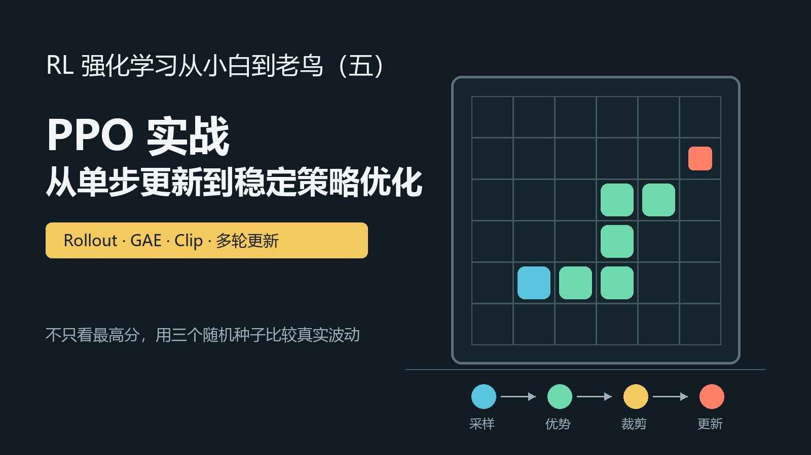
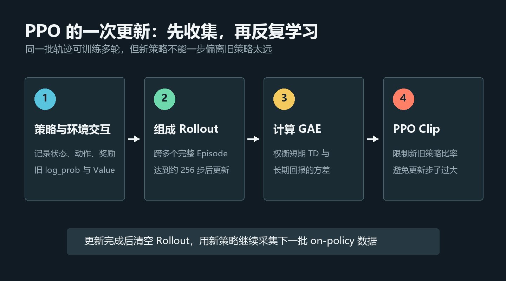
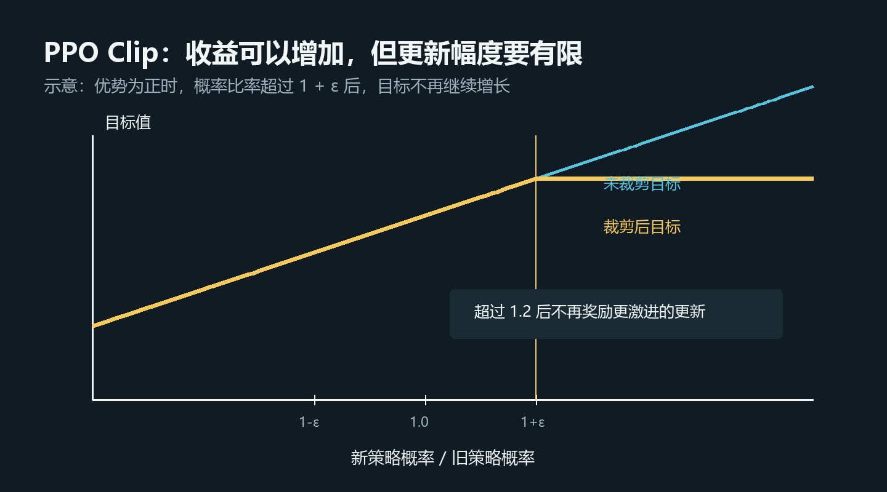
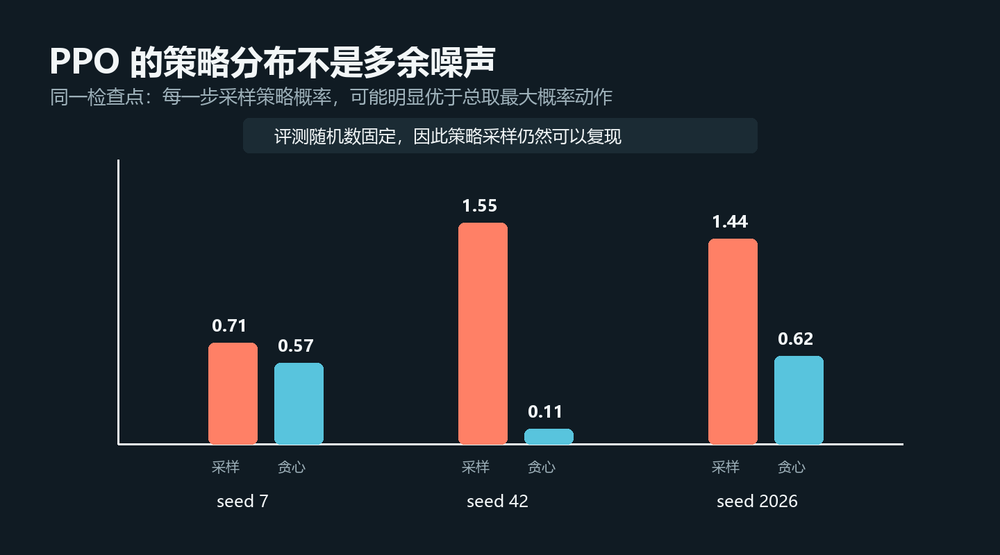
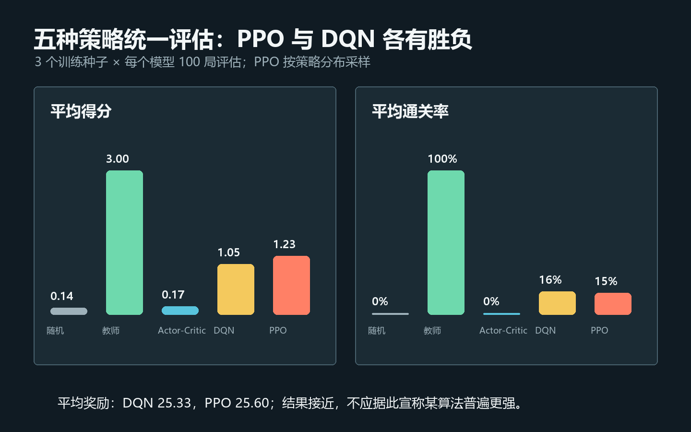

# RL强化学习从小白到老鸟（五）——PPO实战：从单步更新到稳定策略优化

> 项目源码：<https://github.com/NocoldBob/RL>
>
> 第一篇：[速通贪吃蛇游戏](https://blog.csdn.net/bobwww123/article/details/138722671)
>
> 第二篇：[手撕 GPT（零基础保姆级教学）](https://blog.csdn.net/bobwww123/article/details/138948884)
>
> 第三篇：[让贪吃蛇训练更稳定、更容易复现](https://blog.csdn.net/bobwww123/article/details/163925583)
>
> 第四篇：[DQN 实战：四种策略同场对照](https://blog.csdn.net/bobwww123/article/details/163925932)



## 前言：第二篇没有“教错”，第五篇是在它上面继续搭积木

第二篇实现了一个很轻量的单步 Actor-Critic：智能体与环境交互一步，立即用这一步的 TD
误差更新 Actor 和 Critic。它代码短、反馈快，很适合第一次看懂策略梯度怎样工作。

但“适合入门”不等于“已经稳定”。第四篇的三随机种子实验中，这个极简实现的最终确定性
策略波动很大。问题不在于 Actor-Critic 这条路线本身，而在于它每次只看一步、样本相关性
强、一次更新对策略影响又缺少明确限制。

第五篇加入 PPO（Proximal Policy Optimization），重点回答三个问题：

1. 能不能先收集一段轨迹，再批量计算更平滑的优势？
2. 同一批 on-policy 数据能不能训练多轮，提高样本利用率？
3. 怎样限制新策略不要一次偏离旧策略太远？

最终仍然使用普通 CPU、`6×6` 贪吃蛇和三个随机种子，并把 PPO 加入随机策略、启发式教师、
单步 Actor-Critic、DQN 的统一评估。

## 一、PPO 与单步 Actor-Critic 有什么关系

两者都包含两个角色：

- Actor 输出三个离散动作的概率；
- Critic 估计当前状态的价值。

区别主要在训练数据和更新方式。

| 方法 | 数据收集 | 优势估计 | 同批数据更新 | 策略变化限制 |
|---|---|---|---|---|
| 单步 Actor-Critic | 每走一步 | 一步 TD 误差 | 1 次 | 梯度裁剪 |
| PPO | 一段 Rollout | GAE | 多个 Epoch | 概率比率 Clip |

可以把第二篇理解成“最小可运行的策略梯度闭环”，把第五篇理解成“在同一思想上增加批量轨迹、
优势估计和保守更新”。前者帮助看清每个零件，后者开始处理真实训练中的波动。

## 二、PPO 的一次更新发生了什么



项目中的 PPO 循环分成四步。

### 1. 用当前策略与环境交互

每一步除了保存状态、动作和奖励，还要保存**动作当时在旧策略下的概率**以及 Critic 给出的
价值估计：

```python
action, log_probability, value = agent.select_action(observation)
rollout.append(
    observation,
    action,
    reward * config.reward_scale,
    done,
    log_probability,
    value,
)
```

这里保存的是 `log_probability`，因为概率连乘容易变得非常小，强化学习实现通常在对数空间
计算。

### 2. 组成 Rollout

默认累计约 `256` 个环境步。为了让教学实现保持清楚，代码会在一个 Episode 结束后判断是否
达到更新长度，因此实际 Rollout 可能略多于 256 步，但不会把某一局生硬切断。

PPO 是 on-policy 算法：更新完成后这批 Rollout 会被清空，然后用新策略继续采集。它不像
DQN 那样保留一个可以反复随机抽样的大型经验回放池。

### 3. 用 GAE 计算优势

优势函数回答的是：

```text
这个动作的结果，比 Critic 原本认为的平均水平好多少？
```

最简单的一步 TD 误差为：

```text
δ_t = r_t + γV(s_{t+1}) - V(s_t)
```

GAE（Generalized Advantage Estimation）继续把未来的 TD 误差按距离衰减后累加：

```text
A_t = δ_t + γλδ_{t+1} + (γλ)^2δ_{t+2} + ...
```

`λ` 越小，越接近短期 TD，偏差较大但方差较小；`λ` 越接近 1，越重视完整长期回报，偏差
较小但方差可能增大。项目默认 `gamma=0.99`、`gae_lambda=0.95`。

终局位置必须阻断递推，否则上一局的优势会错误地接上下一局。代码使用 `done` 把后续价值和
GAE 都乘为 0，并有自动测试专门锁定这个边界。

### 4. 对同一批数据做多轮 PPO 更新

Rollout 转成批量张量后，优势会标准化：

```python
advantages = (advantages - advantages.mean()) / (advantages.std(unbiased=False) + 1e-8)
```

默认把这批数据打乱成 batch 64，重复训练 4 个 Epoch。这样比单步数据只用一次更充分，但
同一批旧数据训练太多次，又会让新策略偏离采样它们的旧策略，所以接下来需要 Clip。

## 三、PPO Clip 到底裁剪了什么



先计算同一个动作在新旧策略中的概率比率：

```text
r_t = π_new(a_t | s_t) / π_old(a_t | s_t)
```

- `r_t = 1`：动作概率没有改变；
- `r_t = 1.2`：新策略选择这个动作的概率变成原来的 1.2 倍；
- `r_t = 0.8`：概率降为原来的 0.8 倍。

如果优势为正，我们希望增加这个动作的概率；如果优势为负，则希望降低。但一次变化太大，
可能让后续采集到完全不同的数据，训练突然崩掉。PPO 取下面两项中更保守的一项：

```text
L_clip = min(r_t A_t, clip(r_t, 1-ε, 1+ε) A_t)
```

对应实现：

```python
ratio = (new_log_probabilities - old_log_probabilities).exp()
unclipped = ratio * advantages
clipped = ratio.clamp(1.0 - clip_ratio, 1.0 + clip_ratio) * advantages
policy_loss = -torch.minimum(unclipped, clipped).mean()
```

默认 `clip_ratio=0.2`。它不是简单地把梯度裁掉，而是让“继续把策略推得更远”不再带来更好的
目标值。PPO 的名字里 `Proximal`，表达的正是让新旧策略保持相近。

## 四、完整损失还包含 Critic 和熵

本项目一次 PPO 更新的总损失为：

```text
总损失 = 策略损失 + value_coef × 价值损失 - entropy_coef × 策略熵
```

Critic 用均方误差拟合 GAE 得到的回报目标。熵项鼓励策略保留一定的不确定性，避免过早把
某一个动作概率推到接近 100%。最后再使用梯度范数裁剪：

```python
loss.backward()
nn.utils.clip_grad_norm_(model.parameters(), max_norm=0.5)
optimizer.step()
```

训练日志同时记录 `policy_loss`、`value_loss`、`entropy`、近似 KL 散度和裁剪比例。若
`clip_fraction` 长期非常高，往往意味着学习率、更新轮数或 Clip 范围需要重新检查。

## 五、一个小但重要的奖励缩放

贪吃蛇通关会一次得到约 `100` 的奖励，而普通移动奖励只有 `0.1` 量级。直接让 Critic 拟合
跨度很大的原始回报时，价值损失容易压过策略损失。

PPO 默认只在训练内部使用：

```python
training_reward = environment_reward * 0.1
```

这不会修改环境，也不会美化最终成绩：控制台训练奖励、独立评估奖励和五策略基准仍然使用
原始环境奖励。奖励缩放只是给优化器换了一个更容易处理的数值尺度。

## 六、网络仍然适合普通 CPU

PPO 使用一个共享编码器：

```python
self.encoder = nn.Sequential(
    nn.Conv2d(input_channels, 16, kernel_size=3, padding=1),
    nn.ReLU(),
    nn.Flatten(),
    nn.Linear(16 * grid_size * grid_size, 64),
    nn.ReLU(),
)
self.actor = nn.Linear(64, action_count)
self.critic = nn.Linear(64, 1)
```

相较第二篇的极简网络，这里增加了一个 64 维共享隐藏层。它仍然很小，但给策略和值函数增加
了一层非线性表达能力。PPO、DQN 和单步 Actor-Critic 的网络并不完全相同，因此本文比较的
是三个完整教学实现，而不是只替换损失函数的消融实验。

## 七、运行 PPO

### 1. 安装项目

```powershell
git clone https://github.com/NocoldBob/RL.git
cd RL
py -3.12 -m venv .venv
.\.venv\Scripts\Activate.ps1
python -m pip install -r requirements.txt
```

### 2. 先跑短流程检查

```powershell
python .\贪吃蛇\train_ppo.py --episodes 50 --rollout-steps 64 `
  --eval-interval 25 --eval-episodes 5 --output-dir runs\ppo-smoke
```

短流程只是检查交互、Rollout、GAE、PPO 更新、评估和检查点能否完整运行，不代表已经收敛。

### 3. 运行默认训练

```powershell
python .\贪吃蛇\train_ppo.py
```

主要默认参数：

| 参数 | 默认值 | 作用 |
|---|---:|---|
| `episodes` | 1000 | 训练局数 |
| `rollout_steps` | 256 | 每批轨迹的目标步数 |
| `update_epochs` | 4 | 同一 Rollout 重复训练轮数 |
| `batch_size` | 64 | 每次参数更新的样本数 |
| `gamma` | 0.99 | 回报折扣 |
| `gae_lambda` | 0.95 | GAE 偏差与方差权衡 |
| `reward_scale` | 0.1 | 仅用于 PPO 训练的奖励缩放 |
| `clip_ratio` | 0.2 | 新旧策略概率比率裁剪范围 |
| `entropy_coef` | 0.01 | 熵奖励系数 |
| `torch_threads` | 1 | 小模型 CPU 线程数 |

输出目录为：

```text
runs/ppo/
  checkpoints/best.pt
  checkpoints/latest.pt
  history.json
  summary.json
  tensorboard/
```

### 4. 查看训练曲线

```powershell
tensorboard --logdir .\runs\ppo\tensorboard
```

除奖励和得分外，建议同时观察：

- `ppo/policy_loss`：策略目标；
- `ppo/value_loss`：Critic 拟合误差；
- `ppo/entropy`：动作分布还保留多少不确定性；
- `ppo/approx_kl`：新旧策略变化程度；
- `ppo/clip_fraction`：有多少样本触发了 Clip。

### 5. 播放模型

```powershell
python .\贪吃蛇\play_ppo.py .\runs\ppo\checkpoints\best.pt --fps 15
```

默认按照 Actor 输出的策略概率采样动作，并使用固定随机种子，因此可以复现。要观察“每一步
都选最大概率动作”的效果：

```powershell
python .\贪吃蛇\play_ppo.py .\runs\ppo\checkpoints\best.pt `
  --deterministic --fps 15
```

## 八、为什么 PPO 评估默认不是贪心动作



DQN 输出动作价值，评估时自然选择最大 Q 值。PPO 的 Actor 输出的是一个策略分布。我们最初
也尝试把评估设为总取最大概率动作，结果发现它可能破坏策略已经学到的随机性。

在相同 100 张地图上，三个 PPO 检查点的平均得分如下：

| 训练种子 | 按策略采样 | 总取最大概率动作 |
|---:|---:|---:|
| 7 | 0.71 | 0.57 |
| 42 | 1.55 | 0.11 |
| 2026 | 1.44 | 0.62 |

这不代表所有 PPO 都必须随机评估，而是提醒我们：随机策略不等于“训练时加噪声、测试时一定
关闭”。如果任务和目标函数学到的就是策略分布，直接改成贪心策略相当于换了一种决策规则。

为了保证实验可复现，评估环境种子与 PPO 动作采样随机数都被固定。原始数据保存在
`docs/experiments/05-ppo-action-modes.json`。

## 九、五种策略统一评估

完整基准命令：

```powershell
python .\贪吃蛇\benchmark.py --seeds 7 42 2026 --episodes 1000 `
  --eval-episodes 100 --device cpu --torch-threads 1
```

实验条件与第四篇保持一致：

- `6×6` 地图，蛇长度达到 4 视为通关；
- 每局最多 100 步；
- 三个学习算法都训练 1000 个 Episode；
- 训练种子为 `7、42、2026`；
- 每个检查点在相同的 100 张地图上评估；
- Actor-Critic 与 DQN 使用确定性动作；
- PPO 使用固定随机数的策略采样；
- 教师是规则上限参考，不参与训练耗时比较。

这仍是低算力教学基准，不是严格控制网络参数量和环境交互步数的论文级算法排名。

## 十、实测结果



三训练种子的聚合结果如下，`±` 后为种子之间的总体标准差：

| 策略 | 平均奖励 | 平均得分 | 平均通关率 | 平均训练时间 |
|---|---:|---:|---:|---:|
| 随机 | `-2.27 ± 0.27` | `0.14 ± 0.02` | `0%` | 无训练 |
| 启发式教师 | `134.31 ± 0.00` | `3.00 ± 0.00` | `100%` | 规则策略 |
| 单步 Actor-Critic | `-26.64 ± 7.25` | `0.17 ± 0.10` | `0%` | `20.1 ± 2.7 秒` |
| DQN | `25.33 ± 21.56` | `1.05 ± 0.26` | `16.3% ± 9.8%` | `15.4 ± 1.9 秒` |
| PPO | `25.60 ± 13.28` | `1.23 ± 0.37` | `15.3% ± 8.2%` | `9.2 ± 3.2 秒` |

原始 JSON 保存在 `docs/experiments/05-ppo-benchmark.json`。

### 怎样理解 DQN 与 PPO 的结果

PPO 的平均奖励和平均得分略高，DQN 的平均通关率略高。两者差距都不大，且三个种子的波动
仍然明显。因此合理结论是：

> 在当前小网络、奖励设计和 1000 局预算下，PPO 与 DQN 整体表现接近，各项指标互有胜负；
> 两者都明显优于当前单步 Actor-Critic，但都没有接近规则教师。

不能据此写成“PPO全面胜过 DQN”，也不能推广成其他任务上的算法排名。

### 为什么 PPO 的平均训练时间更短

本实现按 Rollout 批量更新，网络很小，且 CPU 只使用一个 PyTorch 线程。DQN 每隔 4 个环境步
从回放池抽样，还需要维护在线网络和目标网络。当前机器上 PPO 因此更快。

训练时间受 CPU、PyTorch 版本、后台负载和 Episode 实际长度影响，只能作为本次实验记录，
不能当作固定性能指标。更加严格的样本效率比较应该统一环境交互步数，而不只是 Episode 数。

## 十一、三个随机种子仍然讲了三个故事

PPO 的逐种子结果：

| 种子 | 平均奖励 | 平均得分 | 通关率 |
|---:|---:|---:|---:|
| 7 | 7.70 | 0.71 | 4% |
| 42 | 29.61 | 1.55 | 19% |
| 2026 | 39.48 | 1.44 | 23% |

如果只展示 `seed=2026`，PPO 看起来已经相当不错；如果只展示 `seed=7`，又会显得提升有限。
多随机种子不是为了让表格更复杂，而是避免我们无意中挑中最符合预期的那一次。

## 十二、留给读者的四个实验

### 实验 A：关闭 Clip 的保护效果

把裁剪范围放得很大：

```powershell
python .\贪吃蛇\train_ppo.py --clip-ratio 1.0 --output-dir runs\ppo-wide-clip
```

比较 `approx_kl`、训练曲线和最终独立评估是否更容易波动。

### 实验 B：减少同批数据更新轮数

```powershell
python .\贪吃蛇\train_ppo.py --update-epochs 1 --output-dir runs\ppo-one-epoch
```

观察训练速度、样本利用率和最终成绩怎样变化。

### 实验 C：改变 GAE 的 λ

```powershell
python .\贪吃蛇\train_ppo.py --gae-lambda 0.5 --output-dir runs\ppo-lambda-05
python .\贪吃蛇\train_ppo.py --gae-lambda 1.0 --output-dir runs\ppo-lambda-10
```

不要只比较某一局最高分，应使用相同评估地图和多个训练种子。

### 实验 D：比较采样策略和贪心策略

训练完成后，用同一个检查点分别运行：

```powershell
python .\贪吃蛇\play_ppo.py
python .\贪吃蛇\play_ppo.py --deterministic
```

观察某些状态下，保留第二选择是否能减少固定循环或过早撞墙。

---

项目地址：<https://github.com/NocoldBob/RL>

建议标签：`强化学习`、`PPO`、`Actor-Critic`、`GAE`、`PyTorch`、`Gymnasium`、`贪吃蛇`、
`策略梯度`、`深度学习`、`人工智能`
