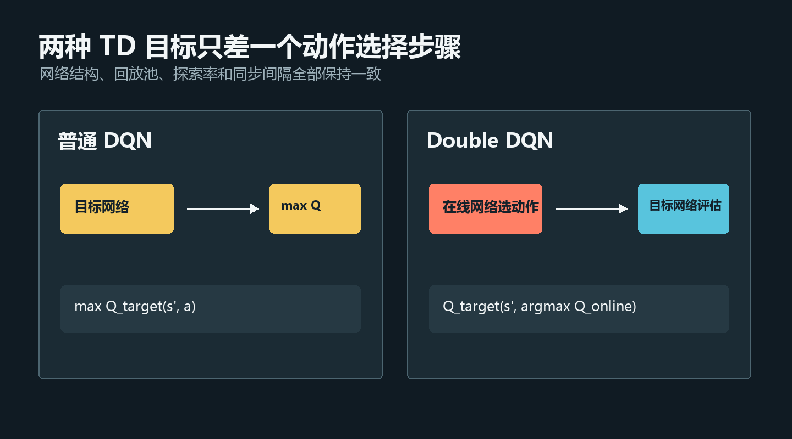
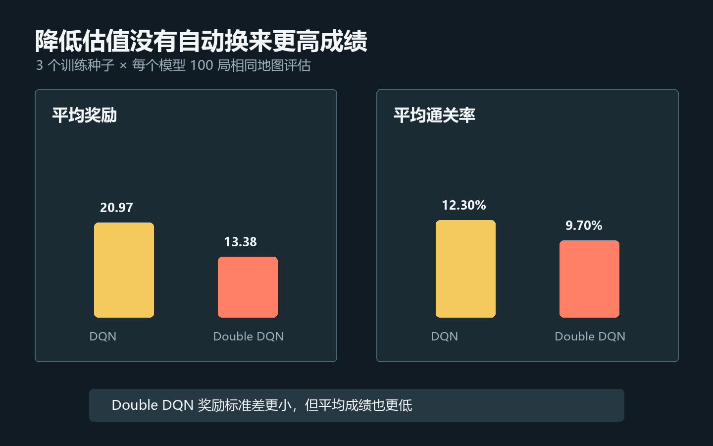
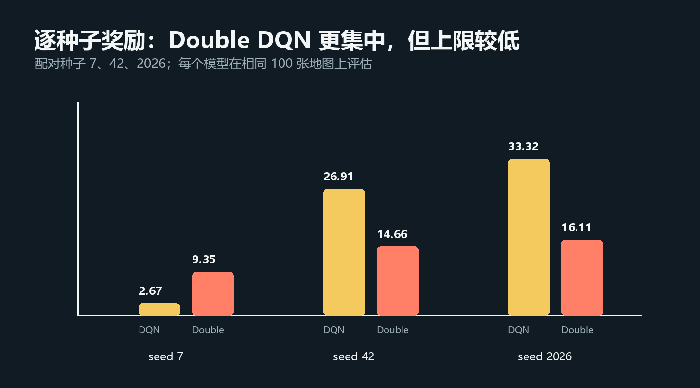
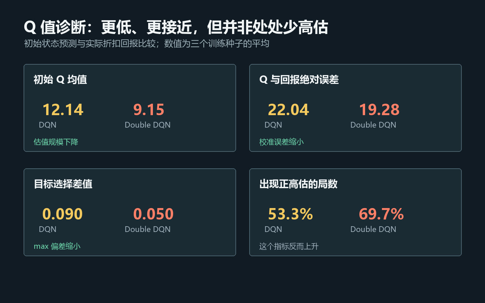

# RL强化学习从小白到老鸟（六）——Double DQN实战：降低Q值，成绩就会更好吗？

> 项目源码：<https://github.com/NocoldBob/RL>
>
> 第一篇：[速通贪吃蛇游戏](https://blog.csdn.net/bobwww123/article/details/138722671)
>
> 第二篇：[手撕 GPT（零基础保姆级教学）](https://blog.csdn.net/bobwww123/article/details/138948884)
>
> 第三篇：[让贪吃蛇训练更稳定、更容易复现](https://blog.csdn.net/bobwww123/article/details/163925583)
>
> 第四篇：[DQN 实战：四种策略同场对照](https://blog.csdn.net/bobwww123/article/details/163925932)
>
> 第五篇：[PPO 实战：从单步更新到稳定策略优化](05-PPO实战从单步更新到稳定策略优化.md)


## 前言：这次的结果没有按照算法名字写剧本

第四篇实现了经验回放、目标网络和 ε-greedy 探索组成的 DQN。第五篇加入 PPO 后，我们已经
不再满足于展示某一次训练的最高分，而是固定三个随机种子，在相同地图上报告均值和波动。

第六篇回到 DQN，研究一个经典问题：

> 同一个价值估计里既选择最大动作，又评价这个动作，会不会把随机误差一起放大？

Double DQN 的改动很小：在线网络负责选动作，目标网络只负责评价。但这次实验得到的结果并
不是“Double DQN 全面胜出”：

- Double DQN 的 Q 值更低，内部目标选择差值更小；
- Q 与实际回报的平均绝对误差有所下降；
- 三个训练种子之间的奖励波动明显缩小；
- 但平均奖励、得分和通关率都低于普通 DQN；
- 按单局统计的正高估比例反而更高。

这不是实验失败。它恰好让我们区分三个经常被混在一起的概念：**最大化偏差、Q 值预测误差、
最终策略成绩**。它们有关联，但不是同一个指标。

## 一、普通 DQN 为什么可能高估

假设某个状态有三个动作，它们真实价值都接近 10，但神经网络存在估计误差：

```text
动作 A：9
动作 B：10
动作 C：12
```

普通 DQN 会取最大值 12。即使每个估计本身有时偏高、有时偏低，`max` 更容易选中正误差最大
的那个动作。长期把这种结果写入 TD 目标，可能形成系统性的最大化偏差。

普通 DQN 的下一状态目标为：

```text
y = r + γ max_a Q_target(s', a)
```

目标网络同时完成两件事：

1. 找到它认为价值最大的动作；
2. 用自己的 Q 值评价这个动作。

如果“选择错误”和“评价错误”来自同一组估计噪声，它们就可能互相强化。

## 二、Double DQN 只拆开两件事



Double DQN 不增加第三个网络，也不修改回放池。它只把动作选择交给在线网络：

```text
a* = argmax_a Q_online(s', a)
```

再让目标网络评价这个已经选好的动作：

```text
y = r + γ Q_target(s', a*)
```

完整写法为：

```text
y = r + γ Q_target(s', argmax_a Q_online(s', a))
```

这相当于让两个网络分工：

- 在线网络回答“选哪个动作”；
- 目标网络回答“这个动作值多少”。

两者仍然不是完全独立的估计器，因为目标网络会定期从在线网络同步参数。但同步间隔内的差异
已经足以减少“同一份误差既参与选择又参与评价”的情况。

## 三、代码到底改了多少

项目在 `DQNAgent` 中增加了一个统一的下一状态价值函数：

```python
@torch.no_grad()
def bootstrap_values(self, next_states, *, double_dqn):
    target_q_values = self.target(next_states)
    if not double_dqn:
        return target_q_values.max(dim=1).values

    next_actions = self.online(next_states).argmax(dim=1, keepdim=True)
    return target_q_values.gather(1, next_actions).squeeze(1)
```

训练更新的其他部分保持不变：

```python
next_q_values = agent.bootstrap_values(
    batch.next_states,
    double_dqn=config.double_dqn,
)
targets = batch.rewards + gamma * (1.0 - batch.dones) * next_q_values
```

这次没有同时加入 Dueling Network、优先经验回放或新的奖励设计。一次只改一个组件，才能让
实验结果具有可解释性。

## 四、如何运行 Double DQN

### 1. 获取项目

```powershell
git clone https://github.com/NocoldBob/RL.git
cd RL
py -3.12 -m venv .venv
.\.venv\Scripts\Activate.ps1
python -m pip install -r requirements.txt
```

### 2. 训练普通 DQN

```powershell
python .\贪吃蛇\train_dqn.py --output-dir runs\dqn
```

### 3. 训练 Double DQN

```powershell
python .\贪吃蛇\train_dqn.py --double-dqn `
  --output-dir runs\double-dqn
```

两条命令的默认网络、回放池容量、batch 大小、学习率、探索率下降曲线和目标网络同步间隔完全
一致。唯一差别是 TD 目标使用普通 DQN 还是 Double DQN 公式。

### 4. 播放模型

原有播放程序同时支持两种检查点：

```powershell
python .\贪吃蛇\play_dqn.py .\runs\double-dqn\checkpoints\best.pt --fps 15
```

检查点会把算法类型保存为 `dqn` 或 `double_dqn`，但旧版 DQN 检查点仍可正常读取。

## 五、怎样证明“高估减少了”

只比较最终分数并不能回答这个问题。于是本次新增
`benchmark_double_dqn.py`，除奖励、得分和通关率外，还记录五组诊断数据。

### 1. 初始状态最大 Q 值

每局重置后，在智能体还没有移动前记录：

```text
max_a Q_online(s_0, a)
```

它表示模型对这张地图初始决策的价值估计。Double DQN 若更保守，通常会表现为较低的 Q 值
规模，但“更低”本身不等于“更准确”。

### 2. 实际折扣回报

模型随后使用零探索的贪心策略完成这一局，记录真实环境奖励：

```text
G_0 = r_0 + γr_1 + γ²r_2 + ...
```

因为环境和策略在评估时都是确定的，同一个种子的地图可以重复得到相同结果。

### 3. Q 与回报差值

定义：

```text
Q-return gap = 初始最大 Q - 实际折扣回报
```

- 大于 0：这一局初始 Q 高于最终实现的回报；
- 小于 0：这一局初始 Q 低于最终实现的回报；
- 越接近 0：在这个诊断定义下越接近实际结果。

同时记录差值绝对值，避免正负误差互相抵消。

### 4. 目标选择差值

对评估轨迹中的状态，同时计算：

```text
max Q_target(s, a)
```

以及：

```text
Q_target(s, argmax Q_online(s, a))
```

两者之差总是大于等于 0。它直接表示：如果目标网络既选动作又评价，比“在线网络选择、目标
网络评价”多出了多少价值。

### 5. 动作分歧率

记录在线网络与目标网络对最大动作意见不一致的状态比例。若两个网络总选同一个动作，普通
DQN 与 Double DQN 在这一状态的目标就没有区别。

## 六、诊断指标的边界

这里的 Q 与实际回报比较不是理论真值证明。

首先，DQN 试图估计的是最优动作价值，而我们实现的回报来自一个有限训练后的贪心策略。
其次，普通 DQN 与 Double DQN 最终学到的是两套不同策略，它们走过的轨迹和拿到的回报也不
相同。因此不能把两种算法的 Q 值直接减在一起，宣称差值就是“修复了多少高估”。

本实验能够可靠说明的是：

- 同一模型对初始状态的预测与自己实际实现回报之间有多大差距；
- 普通目标选择和 Double DQN 目标选择在当前两张网络上相差多少；
- 这些内部差异是否伴随最终成绩变化。

## 七、正式配对实验

运行命令：

```powershell
python .\贪吃蛇\benchmark_double_dqn.py `
  --seeds 7 42 2026 --episodes 1000 --eval-episodes 100 `
  --device cpu --torch-threads 1
```

实验规则：

- 地图大小 `6×6`；
- 蛇长度达到 4 视为通关；
- 每局最多 100 步；
- 每个算法训练 1000 局；
- 配对训练种子为 `7、42、2026`；
- 每个检查点在同一组 100 张地图上评估；
- 两种算法都使用零探索贪心动作；
- 网络、优化器和所有超参数完全相同；
- 评估使用 `gamma=0.99` 计算实际折扣回报。

输出包括 `results.json` 和 `results.csv`。已有训练产物时可以使用：

```powershell
python .\贪吃蛇\benchmark_double_dqn.py --reuse
```

## 八、最终成绩：普通 DQN 平均更高



三训练种子的聚合结果如下，`±` 后为种子之间的总体标准差：

| 算法 | 平均奖励 | 平均得分 | 平均通关率 | 平均训练时间 |
|---|---:|---:|---:|---:|
| DQN | `20.97 ± 13.20` | `1.00 ± 0.17` | `12.3% ± 2.5%` | `15.2 ± 1.6 秒` |
| Double DQN | `13.38 ± 2.91` | `0.75 ± 0.22` | `9.7% ± 4.6%` | `13.7 ± 0.3 秒` |

在当前1000局训练预算下，普通 DQN 的平均奖励、得分和通关率都更高。Double DQN 没有自动
带来性能提升。

但波动呈现了另一面：DQN 的奖励标准差为 `13.20`，Double DQN 只有 `2.91`。后者三个种子
更集中，却集中在一个较低的成绩区间。

训练耗时差异很小，且容易受到首次运行开销、CPU 调度和 Episode 长度影响，不应作为主要
结论。

## 九、三个种子的配对结果



| 种子 | DQN 奖励 | Double DQN 奖励 | DQN 得分 | Double DQN 得分 |
|---:|---:|---:|---:|---:|
| 7 | 2.67 | 9.35 | 0.79 | 0.51 |
| 42 | 26.91 | 14.66 | 1.01 | 0.70 |
| 2026 | 33.32 | 16.11 | 1.21 | 1.05 |

`seed=7` 中 Double DQN 的奖励更高，但平均得分反而更低。这是因为环境奖励还包含移动方向、
新位置、重复访问和终局奖励，不只由吃到多少食物决定。

`seed=42` 和 `seed=2026` 中，普通 DQN 都得到明显更高奖励。若只展示 seed 7，会得出
“Double DQN 有效”的结论；若只展示 seed 2026，又可能断言它明显退步。配对的三个种子让
这种选择性叙事更难发生。

## 十、Q 值真的更准确了吗



| 指标 | DQN | Double DQN |
|---|---:|---:|
| 初始 Q 均值 | `12.14 ± 0.22` | `9.15 ± 0.15` |
| 实际折扣回报均值 | `19.23 ± 8.76` | `12.60 ± 2.95` |
| Q 与回报平均差值 | `-7.10 ± 8.83` | `-3.45 ± 2.88` |
| Q 与回报绝对误差 | `22.04 ± 2.74` | `19.28 ± 6.39` |
| 正高估局数比例 | `53.3% ± 14.6%` | `69.7% ± 4.8%` |
| 目标选择差值 | `0.090 ± 0.061` | `0.050 ± 0.015` |
| 网络动作分歧率 | `35.5% ± 18.0%` | `27.2% ± 2.8%` |

这些数据需要逐层解释。

### 1. Double DQN 的估值规模确实更低

初始 Q 从 `12.14` 降到 `9.15`，说明分离动作选择和评价后，模型整体更保守。

### 2. 平均差值更接近 0

DQN 的平均差值为 `-7.10`，Double DQN 为 `-3.45`。负数表示两者平均都低估了自己最终实现
的折扣回报，而 Double DQN 的平均差值更接近 0。

这意味着当前实验不能写成“普通 DQN 出现了全局正高估”。有限训练、函数逼近和策略质量
带来的低估，同样可能覆盖最大化偏差。

### 3. 绝对误差有所下降

Double DQN 的 Q 与回报绝对误差从 `22.04` 降为 `19.28`。这是支持“校准有所改善”的证据，
但三个种子的误差波动仍然很大。

### 4. 正高估比例反而上升

按单局统计，Double DQN 有 `69.7%` 的初始预测高于实际回报，普通 DQN 为 `53.3%`。为什么
平均差值更接近 0，正高估比例却更高？

因为少量成功通关局的实际回报很高，会产生幅度很大的负差值；大量失败局的实际回报较低，
则可能产生较小的正差值。平均值、绝对值和正负比例描述的是分布的不同侧面，不能互相替代。

### 5. 与 max 直接相关的差值变小

目标选择差值从 `0.090` 降到 `0.050`，网络动作分歧率也从 `35.5%` 降到 `27.2%`。这说明
Double DQN 训练出的在线/目标网络在评估轨迹上更一致，普通 DQN 的 `max` 目标相对 Double
选择方式多出的价值也更小。

## 十一、为什么更保守却没有更高分

可能原因不止一个。

### 1. 当前训练预算并不长

1000个 Episode 对这个教学环境足以看到学习，但未必足以让更保守的价值传播充分收敛。
Double DQN 减少乐观估计的同时，也可能降低了早期发现高回报路径的速度。

### 2. 乐观有时会帮助探索

ε-greedy 已经提供随机探索，但在食物和通关奖励较稀疏时，略显乐观的 Q 值可能让普通 DQN
更积极地重复潜在高价值动作。最大化偏差是估计缺陷，却不保证在每个有限预算任务上都降低
最终分数。

### 3. 超参数来自原有 DQN

学习率、目标同步间隔和探索下降周期最初围绕普通 DQN 教学实现设置。保持参数不变有利于
公平消融，却不代表这些参数也是 Double DQN 的最佳组合。

### 4. 降低一种偏差不等于解决全部误差

状态表示、有限网络容量、回放数据分布、奖励尺度和目标网络滞后都会影响 Q 值。Double DQN
主要处理动作选择中的最大化偏差，不负责修复其他来源的误差。

## 十二、这次实验能得出什么

可以得出：

1. 两种 TD 目标已在同网络、同预算、同种子的条件下完成配对比较；
2. Double DQN 降低了 Q 值规模和目标选择差值；
3. 它使三个种子的奖励结果更集中；
4. Q 与实际回报的平均差值和绝对误差有所改善；
5. 在当前训练预算下，它没有提高平均游戏成绩。

不能得出：

1. Double DQN 普遍不如 DQN；
2. 普通 DQN 在所有状态都高估；
3. Q 值越低就越准确；
4. 三个随机种子足以代表所有超参数和训练预算；
5. 最终分数可以替代价值估计诊断。

## 十三、留给读者的四个实验

### 实验 A：增加训练预算

```powershell
python .\贪吃蛇\benchmark_double_dqn.py --episodes 3000 `
  --output-dir runs\double-dqn-3000
```

观察 Double DQN 的保守价值传播是否在更长训练后追上普通 DQN。

### 实验 B：延长目标网络同步间隔

分别训练：

```powershell
python .\贪吃蛇\train_dqn.py --target-update-interval 1000 `
  --output-dir runs\dqn-target-1000
python .\贪吃蛇\train_dqn.py --double-dqn --target-update-interval 1000 `
  --output-dir runs\double-dqn-target-1000
```

同步间隔增大后，在线网络与目标网络差异可能扩大，Double DQN 的选择分离也可能更明显。

### 实验 C：减慢探索率下降

```powershell
python .\贪吃蛇\train_dqn.py --double-dqn `
  --epsilon-decay-steps 20000 --episodes 3000
```

测试更长随机探索能否弥补保守估值带来的早期学习速度问题。

### 实验 D：增加诊断地图数量

```powershell
python .\贪吃蛇\benchmark_double_dqn.py --eval-episodes 500
```

Q 误差分布容易受少量高回报局影响，增加评估地图可以让正高估比例和绝对误差更稳定。

## 十四、写在最后

Double DQN 的公式很漂亮，代码改动也只有几行。但真实实验没有义务给出同样漂亮的排行榜。

它在本次贪吃蛇实验中降低了估值规模、目标选择差值和部分校准误差，也让随机种子结果更加
集中；与此同时，普通 DQN 在1000局预算下获得了更高的平均奖励、得分和通关率。

这让我们看到，强化学习中的“修复一个理论偏差”和“提高有限预算下的最终成绩”是两个问题。
一个严谨的教程不应该只展示符合标题的数字，更应该保留那些迫使我们重新理解标题的数据。

下一篇可以加入 Dueling Network，把状态价值和动作优势拆开，再比较：

```text
DQN → Double DQN → Dueling Double DQN
```

届时仍然保持一次只增加一个核心组件，并继续使用配对种子和原始数据文件。

---

项目地址：<https://github.com/NocoldBob/RL>

原始实验：`docs/experiments/06-double-dqn-benchmark.json`

建议标签：`强化学习`、`DQN`、`Double DQN`、`Q学习`、`PyTorch`、`Gymnasium`、`贪吃蛇`、
`价值高估`、`深度学习`、`人工智能`
