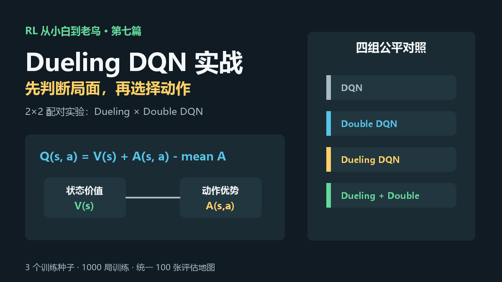
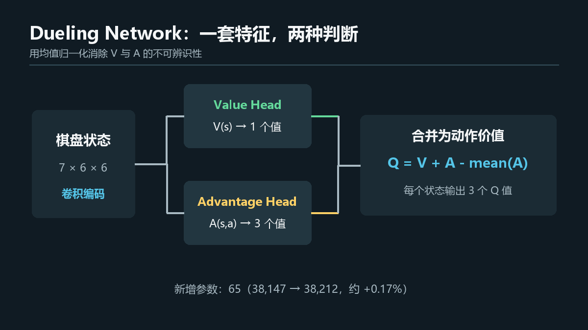
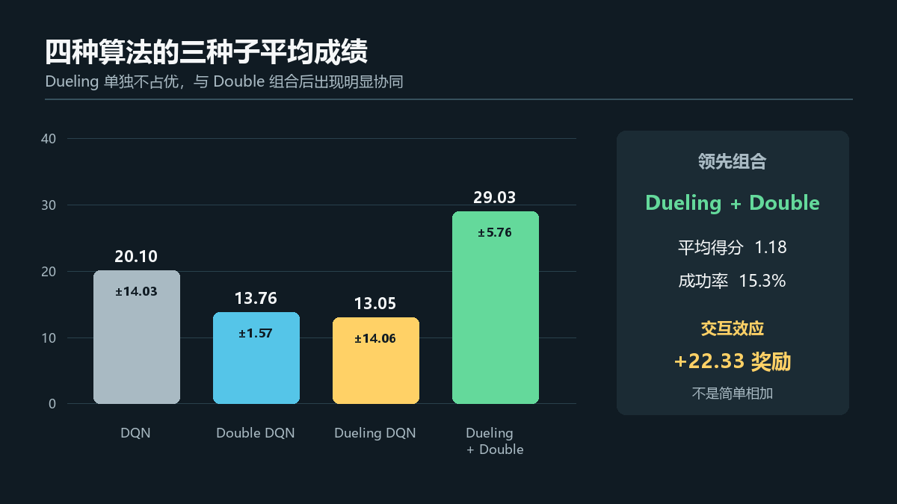
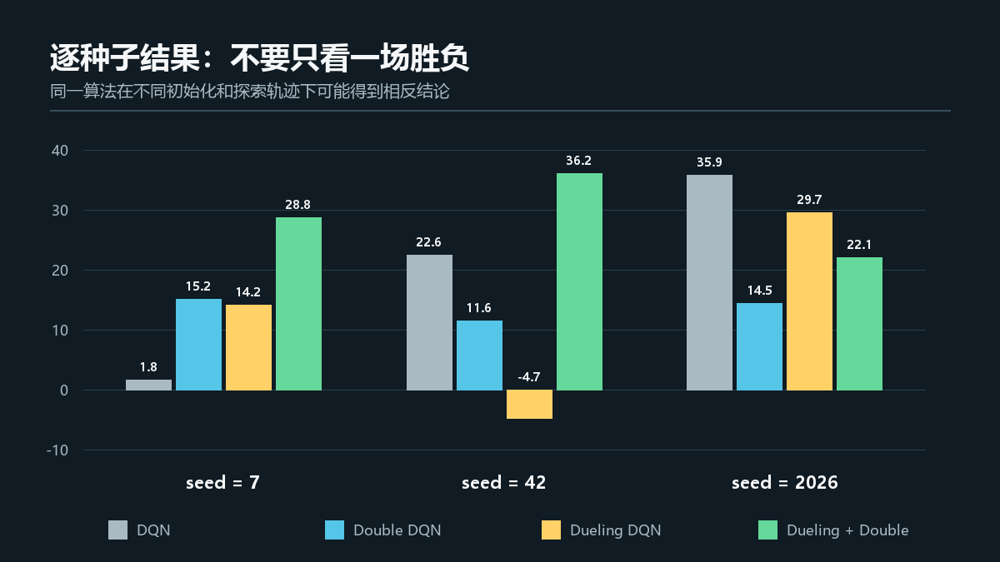
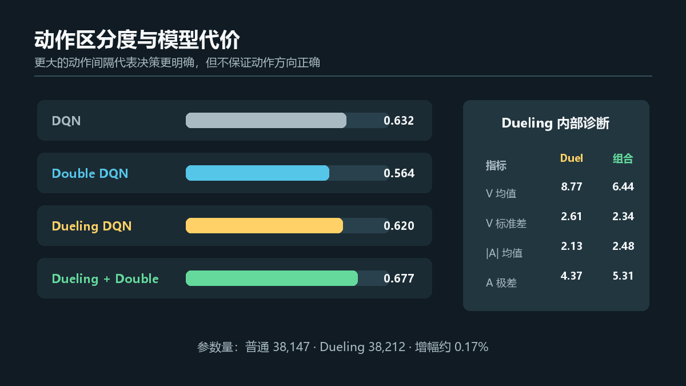

# RL强化学习从小白到老鸟（七）——Dueling DQN实战：先判断局面，再选择动作

> 项目源码：<https://github.com/NocoldBob/RL>
>
> 第一篇：[速通贪吃蛇游戏](https://blog.csdn.net/bobwww123/article/details/138722671)
>
> 第二篇：[手撕 GPT（零基础保姆级教学）](https://blog.csdn.net/bobwww123/article/details/138948884)
>
> 第三篇：[让贪吃蛇训练更稳定、更容易复现](https://blog.csdn.net/bobwww123/article/details/163925583)
>
> 第四篇：[DQN 实战：四种策略同场对照](https://blog.csdn.net/bobwww123/article/details/163925932)
>
> 第五篇：[PPO 实战：从单步更新到稳定策略优化](https://blog.csdn.net/bobwww123/article/details/163926240)
>
> 第六篇：[Double DQN 实战：降低 Q 值，成绩就会更好吗](https://blog.csdn.net/bobwww123/article/details/163937191)



## 前言：先看清局面，还是直接给动作打分

普通 DQN 接收一个状态，直接输出三个动作的 Q 值：左转、右转、直行各值多少。

但有些局面存在一个共同特点：无论选择哪个动作，整体都很好或都很危险。例如蛇头被身体和
边界包围时，三个动作可能都不理想；面对开阔区域时，多个动作可能都可以接受。

Dueling Network 的想法是把判断拆成两部分：

1. 这个局面整体有多好，记为状态价值 `V(s)`；
2. 在这个局面中，各动作相对有多好，记为动作优势 `A(s,a)`。

然后再把它们合成 Q 值。直觉上，它让网络先回答“当前局面怎么样”，再回答“在这里哪个动作
更值得选”。

不过这一篇不会直接假设 Dueling 一定更强。我们做一个完整的 `2×2` 配对实验：

| 网络结构 | 普通 DQN 目标 | Double DQN 目标 |
|---|---|---|
| 普通 Q 网络 | DQN | Double DQN |
| Dueling 网络 | Dueling DQN | Dueling Double DQN |

这样既能观察 Dueling 的单独作用，也能观察它与 Double DQN 是否存在组合效果。

## 一、普通 Q 网络混合了两种信息

普通 DQN 的最后一层直接输出：

```text
Q(s, 左转), Q(s, 右转), Q(s, 直行)
```

这些数字同时承担两项工作：

- 描述状态本身的质量；
- 描述动作之间的相对差异。

如果某个状态下三个动作差别很小，普通网络仍然要分别学习三个 Q 值。三个输出中会重复包含
大量“这个状态整体不错”的信息。

Dueling Network 希望共享这部分信息，让状态价值只学一次，把剩余容量用于学习动作差异。

## 二、Dueling Network 怎样拆分 Q 值



网络先使用同一个卷积编码器提取状态特征，然后分成两个输出头：

```text
Value Head:     V(s)      → 1 个值
Advantage Head: A(s, a)   → 3 个值
```

最直观的合并方式似乎是：

```text
Q(s, a) = V(s) + A(s, a)
```

但这个写法存在不可辨识问题。例如给 `V` 加 1，同时给每个 `A` 减 1，最终 Q 值完全不变。
网络无法确定哪一部分应该由 V 表示，哪一部分应该由 A 表示。

本项目采用论文中常见的均值归一化写法：

```text
Q(s, a) = V(s) + A(s, a) - mean_a A(s, a)
```

减去动作优势均值后，每个状态下的优势贡献均值为 0，`V(s)` 就对应这一组 Q 值的中心。

## 三、代码实现

核心网络只需要一个共享编码器和两个线性输出头：

```python
class DuelingQNetwork(nn.Module):
    def __init__(self, input_channels, action_count, grid_size):
        super().__init__()
        feature_dim = 16 * grid_size * grid_size
        self.encoder = nn.Sequential(
            nn.Conv2d(input_channels, 16, kernel_size=3, padding=1),
            nn.ReLU(),
            nn.Flatten(),
            nn.Linear(feature_dim, 64),
            nn.ReLU(),
        )
        self.value_head = nn.Linear(64, 1)
        self.advantage_head = nn.Linear(64, action_count)

    def forward(self, observation):
        features = self.encoder(observation)
        value = self.value_head(features)
        advantage = self.advantage_head(features)
        return value + advantage - advantage.mean(dim=1, keepdim=True)
```

原来的普通 Q 网络没有被删除。`DQNAgent` 根据 `dueling` 开关选择网络类型，因此旧命令、旧
检查点和原有教学流程保持兼容。

在默认 `6×6` 环境中：

```text
普通 Q 网络：     38,147 个参数
Dueling 网络：    38,212 个参数
新增：                 65 个参数，约 0.17%
```

增加的 65 个参数正是 `Value Head` 的 `64` 个权重和 `1` 个偏置。因此这次性能差异不太可能
只是由模型规模大幅增加造成。

## 四、Dueling 与 Double 解决的不是同一件事

这两个名字经常一起出现，但它们修改的是两个不同位置：

- **Dueling Network** 修改网络结构，把 `Q` 分解为状态价值和动作优势；
- **Double DQN** 修改 TD 目标，让在线网络选动作、目标网络评价动作。

所以二者可以独立开关：

```text
DQN                    普通网络 + 普通目标
Double DQN             普通网络 + Double 目标
Dueling DQN            Dueling 网络 + 普通目标
Dueling Double DQN     Dueling 网络 + Double 目标
```

正因为它们作用不同，不能只比较 DQN 和 Dueling Double DQN，然后把全部差异都归功于 Dueling。
四组全因子对照可以把两个组件的作用拆得更清楚。

## 五、如何运行四种模型

### 1. 获取项目和安装依赖

```powershell
git clone https://github.com/NocoldBob/RL.git
cd RL
py -3.12 -m venv .venv
.\.venv\Scripts\Activate.ps1
python -m pip install -r requirements.txt
```

### 2. 分别训练

普通 DQN：

```powershell
python .\贪吃蛇\train_dqn.py --output-dir runs\dqn
```

Double DQN：

```powershell
python .\贪吃蛇\train_dqn.py --double-dqn --output-dir runs\double-dqn
```

Dueling DQN：

```powershell
python .\贪吃蛇\train_dqn.py --dueling --output-dir runs\dueling-dqn
```

Dueling Double DQN：

```powershell
python .\贪吃蛇\train_dqn.py --dueling --double-dqn `
  --output-dir runs\dueling-double-dqn
```

播放程序会从检查点配置中识别普通或 Dueling 网络：

```powershell
python .\贪吃蛇\play_dqn.py `
  .\runs\dueling-double-dqn\checkpoints\best.pt --fps 15
```

## 六、正式实验规则

本次使用新脚本 `benchmark_dueling_dqn.py` 统一训练和评估四种模型：

```powershell
python .\贪吃蛇\benchmark_dueling_dqn.py `
  --seeds 7 42 2026 --episodes 1000 --eval-episodes 100 `
  --device cpu --torch-threads 1
```

实验规则如下：

- 地图大小为 `6×6`；
- 蛇长度达到 4 视为通关；
- 每局最多 100 步；
- 每个模型训练 1000 局；
- 训练种子固定为 `7、42、2026`；
- 每个检查点使用同一组 100 张地图评估；
- 评估时使用零探索贪心动作；
- 四组使用相同回放池、batch、学习率、探索曲线和目标同步间隔；
- 除网络结构和 TD 目标两个因子外，其他条件保持一致。

脚本输出 `results.json` 和 `results.csv`。若训练检查点已经存在，可以使用 `--reuse` 只重新
评估和汇总。

## 七、总体成绩：组合模型领先



三训练种子的聚合结果如下，`±` 后为种子之间的总体标准差：

| 算法 | 平均奖励 | 平均得分 | 平均通关率 | 平均训练时间 |
|---|---:|---:|---:|---:|
| DQN | `20.10 ± 14.03` | `0.98 ± 0.20` | `12.3% ± 3.4%` | `15.0 ± 1.8 秒` |
| Double DQN | `13.76 ± 1.57` | `0.68 ± 0.18` | `10.0% ± 4.2%` | `13.7 ± 0.2 秒` |
| Dueling DQN | `13.05 ± 14.06` | `0.75 ± 0.28` | `8.7% ± 3.8%` | `15.5 ± 0.7 秒` |
| Dueling Double DQN | `29.03 ± 5.76` | `1.18 ± 0.20` | `15.3% ± 3.3%` | `16.0 ± 0.4 秒` |

结果不是“加入 Dueling 就稳定提升”：

- Dueling DQN 的平均奖励比普通 DQN 低 `7.05`；
- Double DQN 的平均奖励也比普通 DQN 低 `6.34`；
- 两者组合后，平均奖励反而比普通 DQN 高 `8.93`；
- 组合模型同时取得最高平均得分和通关率。

这提示两种改进在当前任务和预算下可能存在协同，而不是各自独立带来稳定增益。

## 八、为什么还要计算交互效应

全因子实验可以估算三个量：Dueling 主效应、Double 主效应，以及二者交互效应。

以奖励为例，按每个种子的配对差值计算后再取平均：

```text
Dueling 主效应： +4.11
Double 主效应：  +4.82
交互效应：      +22.33
```

这里的主效应会同时考虑另一个开关打开和关闭时的差值。例如 Dueling 主效应不是简单用
`Dueling DQN - DQN`，而是还包含组合模型与 Double DQN 的差值。

交互效应定义为：

```text
(Dueling Double - Dueling) - (Double - DQN)
```

如果两个组件只是简单相加，交互应接近 0。本次得到较大的正交互，说明 Double 目标在
Dueling 结构下的作用，与它在普通结构下的作用明显不同。

不过这里只使用三个训练种子。交互效应是这次实验的现象，不是已经得到统计学充分验证的普遍
规律。

## 九、逐种子看，故事没有均值那么整齐



| 种子 | DQN | Double DQN | Dueling DQN | Dueling Double DQN |
|---:|---:|---:|---:|---:|
| 7 | `1.80` | `15.18` | `14.20` | `28.76` |
| 42 | `22.63` | `11.57` | `-4.72` | `36.22` |
| 2026 | `35.87` | `14.52` | `29.65` | `22.11` |

组合模型在 seed 7 和 seed 42 中第一，但在 seed 2026 中低于 DQN 和 Dueling DQN。

如果只展示 seed 42，我们会觉得 Dueling Double DQN 是压倒性升级；如果只展示 seed 2026，
又会发现普通 DQN 才是冠军。三个种子的结果提醒我们：强化学习中的初始化、早期探索轨迹和
回放数据分布，足以改变最终排名。

## 十、动作区分度变大，等于决策更好吗



本次额外记录了两个动作区分指标：

```text
动作极差 = max Q(s,a) - min Q(s,a)
动作间隔 = 最大 Q(s,a) - 第二大 Q(s,a)
```

动作间隔越大，表示模型对第一选择相对第二选择更坚定。三种子平均结果为：

| 算法 | Q 动作极差 | 第一、第二动作间隔 |
|---|---:|---:|
| DQN | `4.909 ± 1.400` | `0.632 ± 0.182` |
| Double DQN | `4.647 ± 0.867` | `0.564 ± 0.168` |
| Dueling DQN | `4.373 ± 1.132` | `0.620 ± 0.150` |
| Dueling Double DQN | `5.315 ± 0.722` | `0.677 ± 0.132` |

组合模型的动作极差和第一、第二动作间隔都最大，而且种子波动相对较小。但 Dueling DQN 单独
使用时并没有让这两个均值全面超过普通 DQN。

更重要的是：**动作间隔大只代表更坚定，不代表方向正确。** seed 42 的 Dueling DQN 平均
奖励为 `-4.72`，但它仍可能对错误动作给出很明确的排序。价值网络的“自信”不能替代环境
回报验证。

## 十一、V 和 A 内部到底学到了什么

普通网络没有可单独解释的 V、A 输出。Dueling 两组模型在评估轨迹上的内部统计为：

| 指标 | Dueling DQN | Dueling Double DQN |
|---|---:|---:|
| `V(s)` 均值 | `8.77` | `6.44` |
| `V(s)` 标准差 | `2.61` | `2.34` |
| `|A(s,a)|` 均值 | `2.13` | `2.48` |
| 动作优势极差 | `4.37` | `5.31` |

组合模型学到的状态价值中心更保守，但动作优势的绝对规模和极差更大。可以把它理解为：它对
局面的基础估值较低，同时更依赖动作之间的相对差异做选择。

这是一种可观察的内部表征，不应被写成因果证明。两组模型访问的轨迹不同，统计中的状态分布
也会随策略改变。

## 十二、这次实验能说明什么

可以说明：

1. Dueling 网络已在不破坏旧 DQN 流程的前提下实现；
2. 四种算法在相同训练预算和配对种子下完成了全因子对照；
3. Dueling 只增加 65 个参数，计算代价很小；
4. Dueling 或 Double 单独使用都没有稳定超过普通 DQN；
5. 二者组合取得最高三种子平均成绩，并表现出较大的正交互；
6. 动作优势分解可以提供普通 Q 网络没有的内部诊断。

不能说明：

1. Dueling Double DQN 在所有环境中都优于 DQN；
2. 三个随机种子已经足以证明统计显著性；
3. 动作 Q 间隔越大，策略一定越好；
4. `V(s)` 或 `A(s,a)` 可以脱离策略访问分布直接比较；
5. 当前超参数分别是四种算法的最优配置。

## 十三、留给读者的实验

### 实验 A：增加训练种子

```powershell
python .\贪吃蛇\benchmark_dueling_dqn.py `
  --seeds 1 2 3 4 5 6 7 8 9 10 --reuse
```

新种子没有现成检查点时仍会自动训练。更多种子可以判断正交互是否稳定存在。

### 实验 B：增加训练预算

```powershell
python .\贪吃蛇\benchmark_dueling_dqn.py --episodes 3000 `
  --output-dir runs\dueling-dqn-3000
```

观察 Dueling DQN 单独使用时是否只是学习速度较慢。

### 实验 C：只比较网络结构

训练 DQN 与 Dueling DQN，保持 `--double-dqn` 都关闭。这个对照最适合观察结构本身的作用。

### 实验 D：观察单张地图的 V 与 A

从同一条轨迹连续记录 `V(s)` 和三个 `A(s,a)`，观察接近墙壁、吃到食物和进入开阔区域时，
状态价值与动作优势分别怎样变化。

## 十四、写在最后

Dueling Network 的代码很短：共享编码器之后增加两个输出头，再用一行公式合并。但实验结果
再次提醒我们，短代码不等于简单结论。

在本次贪吃蛇任务中，Dueling 单独使用没有提高三种子平均成绩，Double DQN 单独使用也没有；
两者组合后却取得最高平均奖励、得分和通关率。这正是四组全因子对照比“新算法对旧算法”单次
比赛更有价值的地方。

下一篇可以暂时离开算法名词，给环境加入障碍地图和课程难度。到那时要问的不再只是“谁在同一
张简单地图上分数最高”，而是“策略能否从简单任务逐步学会更复杂的地图，并泛化到未见布局”。

---

项目地址：<https://github.com/NocoldBob/RL>

原始实验：`docs/experiments/07-dueling-dqn-benchmark.json`

建议标签：`强化学习`、`Dueling DQN`、`Double DQN`、`DQN`、`PyTorch`、`Gymnasium`、
`贪吃蛇`、`消融实验`、`深度学习`、`人工智能`
