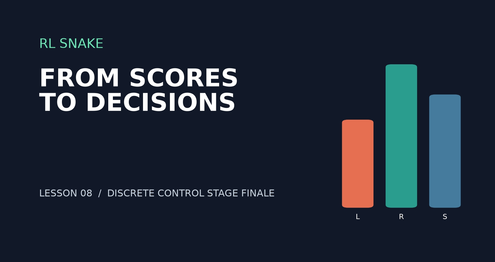
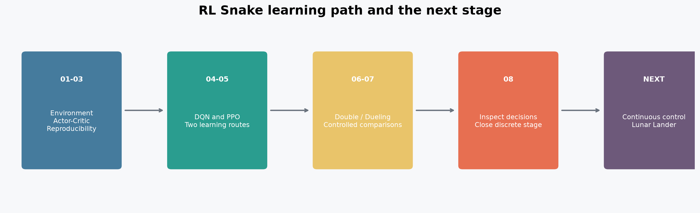
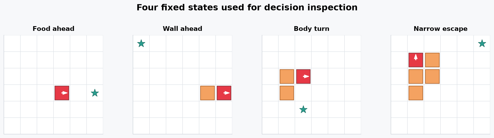
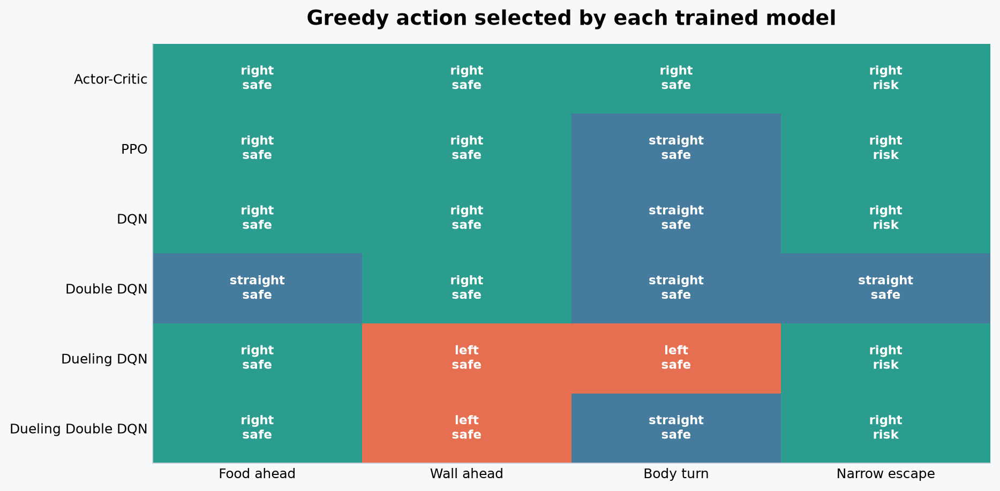
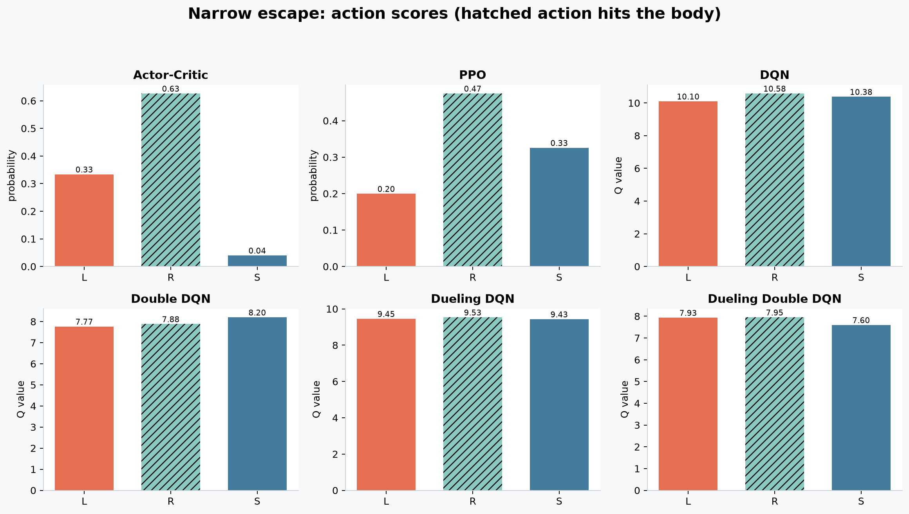
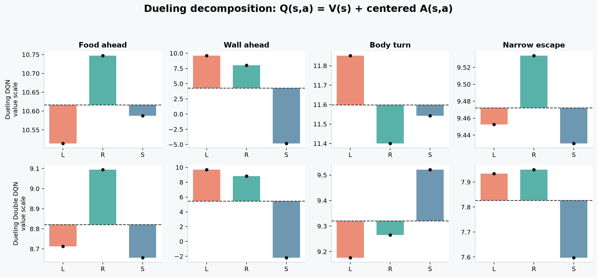

# RL强化学习从小白到老鸟（八）——七篇之后，我们到底学会了什么

> 项目源码：<https://github.com/NocoldBob/RL>
>
> 第一篇：[速通贪吃蛇游戏](https://blog.csdn.net/bobwww123/article/details/138722671)
>
> 第二篇：[手撕 GPT（零基础保姆级教学）](https://blog.csdn.net/bobwww123/article/details/138948884)
>
> 第三篇：[让贪吃蛇训练更稳定、更容易复现](https://blog.csdn.net/bobwww123/article/details/163925583)
>
> 第四篇：[DQN 实战：四种策略同场对照](https://blog.csdn.net/bobwww123/article/details/163925932)
>
> 第五篇：[PPO 实战：从单步更新到稳定策略优化](https://blog.csdn.net/bobwww123/article/details/163926240)
>
> 第六篇：[Double DQN 实战：降低 Q 值，成绩就会更好吗](https://blog.csdn.net/bobwww123/article/details/163937191)
>
> 第七篇：[Dueling DQN 实战：先判断局面，再选择动作](https://blog.csdn.net/bobwww123/article/details/163937626)



## 前言：这一次先不增加新算法

前七篇从一个能运行的贪吃蛇开始，依次加入了强化学习环境、Actor-Critic、独立评估、DQN、
PPO、Double DQN 和 Dueling Network。

算法越来越多，表格也越来越长。到了这里，一个更重要的问题出现了：

> 我们除了知道哪个模型平均分更高，能不能看见它在同一个局面里到底选择了什么？

第八篇不再增加网络结构，而是给已有模型做一次“固定局面检查”。这既是前七篇的阶段复盘，
也是贪吃蛇离散动作课程的收尾。



## 一、七篇内容其实围绕三件事展开

把代码和算法名称暂时放到一边，前七篇主要完成了三件事。

### 1. 让智能体真的在与环境交互

状态里不仅要有蛇身、食物和边界，还要有蛇头方向。动作必须由智能体明确传入，奖励、终止
状态和下一帧观测也要保持一致。环境契约不正确，后面的算法再复杂也没有意义。

### 2. 建立可以复现的比较方法

训练环境和评估环境相互独立；随机种子、训练预算和评估地图明确记录；随机策略、教师策略
和学习模型承担不同角色。单个最好成绩可以展示，但不能替代多种子统计。

### 3. 从不同角度学习决策

| 路线 | 代表方法 | 模型学习的内容 |
|---|---|---|
| 规则基线 | 教师策略 | 人工编写的安全与距离规则 |
| 策略路线 | Actor-Critic、PPO | 各动作的选择概率 |
| 价值路线 | DQN、Double DQN | 各动作的长期回报估计 |
| 表征改进 | Dueling DQN | 状态价值与相对动作优势 |

这些输出都能决定动作，但含义并不相同。策略概率是归一化后的动作分布；Q 值是折扣回报的
估计；Dueling 中的 `V(s)` 是一组动作价值的中心。它们不能脱离各自模型直接比较数值大小。

## 二、为什么要设计固定局面

直接播放一局游戏很直观，但不同模型会走到不同位置，看到不同食物，也可能在不同步数结束。
我们无法判断差异来自模型本身，还是来自它们访问了不同状态。

这次手工构造四个 `6×6` 局面，让六个模型读取完全相同的观测：



四个局面分别检查：

1. **Food ahead**：前方开阔，食物在蛇头前方；
2. **Wall ahead**：继续直行会撞墙；
3. **Body turn**：弯曲的蛇身影响局部几何关系；
4. **Narrow escape**：右转立即撞到身体，左转和直行暂时安全。

动作仍然是相对于蛇头方向的 `left`、`right`、`straight`。脚本还会用环境碰撞规则检查每个
动作执行一步后是否立即安全。这里检查的只是“下一步会不会碰撞”，不是对长期路线的完整证明。

## 三、实验对象与检查规则

本次读取第 5 篇和第 7 篇实验生成的 `seed=42` 检查点：

- Actor-Critic；
- PPO；
- DQN；
- Double DQN；
- Dueling DQN；
- Dueling Double DQN。

所有模型都使用贪心方式选动作：策略模型选择概率最大的动作，DQN 家族选择 Q 值最大的动作。
检查过程不继续训练，也不修改模型参数。

需要特别说明：这不是六种算法的新性能排名。我们只检查一个训练种子的四个状态，它适合发现
具体问题，不足以推断某种算法普遍更强或更安全。

## 四、六个模型在同一局面怎样选择



图中每个单元格给出模型选择的动作。红色 `RISK` 表示这个动作执行一步就会碰撞。

结果有两个值得注意的地方：

- 四个局面中，六个模型都没有完全一致；
- 24 次决策中有 19 次立即安全，5 次风险选择全部出现在 `Narrow escape`。

在撞墙这种训练中频繁出现的简单状态上，所有模型都避开了直行。到了蛇身构成的狭窄局面，
只有这次训练得到的 Double DQN 选择直行，其余五个模型都选择了会立即撞到身体的右转。

这说明平均成绩无法回答每一个局部状态的问题。一个模型可以在许多普通地图上取得不错均值，
同时仍然存在稳定失败的特殊状态。

## 五、放大观察“狭窄逃生”局面



策略模型输出的是动作概率：

| 模型 | 左转 | 右转（碰撞） | 直行 | 最终选择 |
|---|---:|---:|---:|---|
| Actor-Critic | `0.33` | `0.63` | `0.04` | 右转 |
| PPO | `0.20` | `0.47` | `0.33` | 右转 |

DQN 家族输出的是 Q 值：

| 模型 | 左转 | 右转（碰撞） | 直行 | 最终选择 |
|---|---:|---:|---:|---|
| DQN | `10.10` | `10.58` | `10.38` | 右转 |
| Double DQN | `7.77` | `7.88` | `8.20` | 直行 |
| Dueling DQN | `9.45` | `9.53` | `9.43` | 右转 |
| Dueling Double DQN | `7.93` | `7.95` | `7.60` | 右转 |

最重要的结论不是“Double DQN 最安全”。这里只能说，**这个 seed 的这个检查点在这个状态上**，
Double DQN 恰好给安全的直行动作最高 Q 值。

另外，模型对某个动作给出最高概率或最高 Q 值，也不代表它具备显式安全判断。神经网络根据
训练分布拟合决策；如果某种蛇身结构出现较少，模型就可能把局部特征泛化到错误动作上。

## 六、Dueling Network 的 V 和 A 可以怎么看

Dueling Network 将 Q 值写成：

```text
Q(s, a) = V(s) + A(s, a) - mean_a A(s, a)
```

下面把两个 Dueling 模型在四个固定状态中的内部输出拆开：



虚线是状态价值 `V(s)`，彩色柱是中心化后的动作优势，黑点是最终 Q 值。动作优势经过减均值
处理，因此同一状态下三根柱子的平均值为 0。

这张图让“先判断局面，再比较动作”变得可见，但也提醒我们：

- `V(s)` 较高不代表每个动作都安全；
- 动作优势描述的是模型内部的相对排序，不是环境碰撞规则；
- Q 值第一名与第二名差距很小，也可能因为排序方向错误而直接失败。

在狭窄逃生局面中，Dueling Double DQN 给右转的 Q 值只比左转高约 `0.016`，模型看起来并不
坚定，但贪心决策仍会执行右转。最终动作只看排序，微小差异也会变成完全不同的轨迹。

## 七、固定状态检查与平均成绩各自回答什么

前面的多种子基准回答的是：在一批完整游戏中，模型平均能取得怎样的奖励、得分和通关率。
本篇固定状态检查回答的是：在某个可解释局面里，模型更偏向哪个动作，内部输出是什么。

| 方法 | 优点 | 不能单独回答的问题 |
|---|---|---|
| 多种子完整评估 | 更接近总体游戏表现 | 具体在哪种状态失败 |
| 固定状态检查 | 容易定位动作与表征问题 | 长期平均性能和统计显著性 |
| 游戏画面回放 | 轨迹直观，便于发现现象 | 不同模型是否面对同一状态 |

三种方法应该相互补充。只看平均分会漏掉局部错误，只看几个固定局面又容易把个案放大成算法
结论。

## 八、运行第八篇代码

先生成本篇所需检查点。第一个命令训练 Actor-Critic、PPO 等五种策略，并明确把结果保存到
检查脚本默认读取的目录：

```powershell
python .\贪吃蛇\benchmark.py --seeds 7 42 2026 --episodes 1000 `
  --eval-episodes 100 --device cpu --torch-threads 1 `
  --output-dir runs\benchmark-ppo
```

再训练四种 DQN 组合：

```powershell
python .\贪吃蛇\benchmark_dueling_dqn.py --seeds 7 42 2026 `
  --episodes 1000 --eval-episodes 100 --device cpu --torch-threads 1
```

如果检查点已经存在，可以给两个命令增加 `--reuse`。最后执行：

```powershell
python .\贪吃蛇\inspect_decisions.py
```

脚本会生成机器可读的 `docs/experiments/08-decision-inspection.json`，以及本文使用的固定局面、
动作矩阵、局部细节和 Dueling 分解图。也可以通过命令行参数传入自己的六个检查点。

## 九、这一阶段真正完成了什么

七种算法名称不是这组教程最重要的结果。更值得保留的是一套可以继续迁移的方法：

1. 先明确环境的状态、动作、奖励和终止条件；
2. 用简单规则和随机策略建立基线；
3. 保存检查点，并把训练与评估分开；
4. 比较算法时控制训练预算、种子和评估地图；
5. 同时观察总体成绩、估计偏差和具体状态；
6. 对有限实验只做有限结论。

当前实验仍然只是 `6×6` 小地图、有限训练预算和三个训练种子。奖励设计、状态分布和超参数都
会影响结果，固定局面更不等于安全认证。

贪吃蛇的动作只有左转、右转和直行，适合把离散动作强化学习的基本问题讲清楚。到这里，
这个项目的离散控制阶段告一段落。下一阶段将换一个能连续控制力度的环境，从动作空间变化
开始，再逐步进入连续控制算法。
