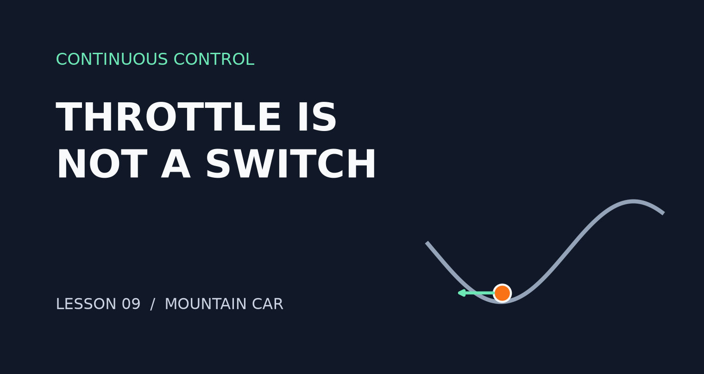
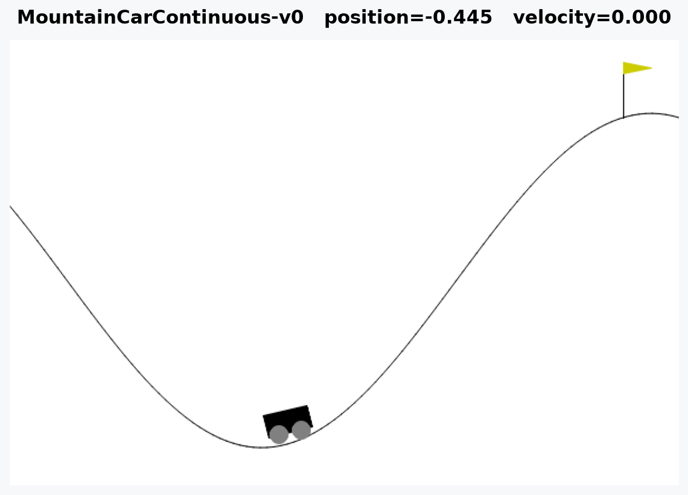
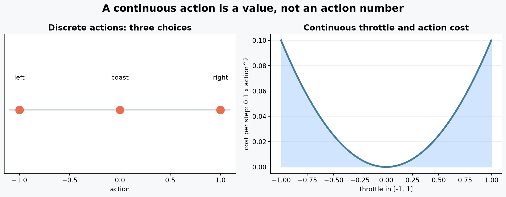
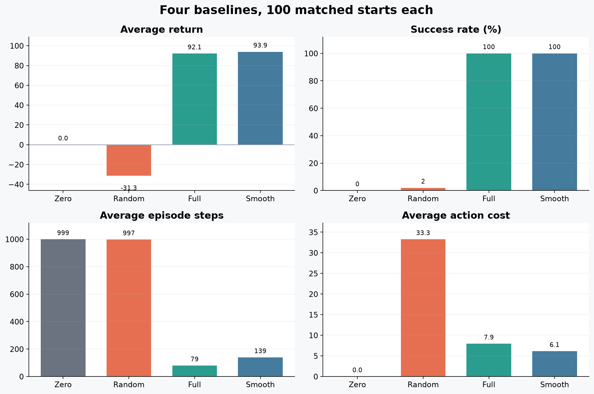
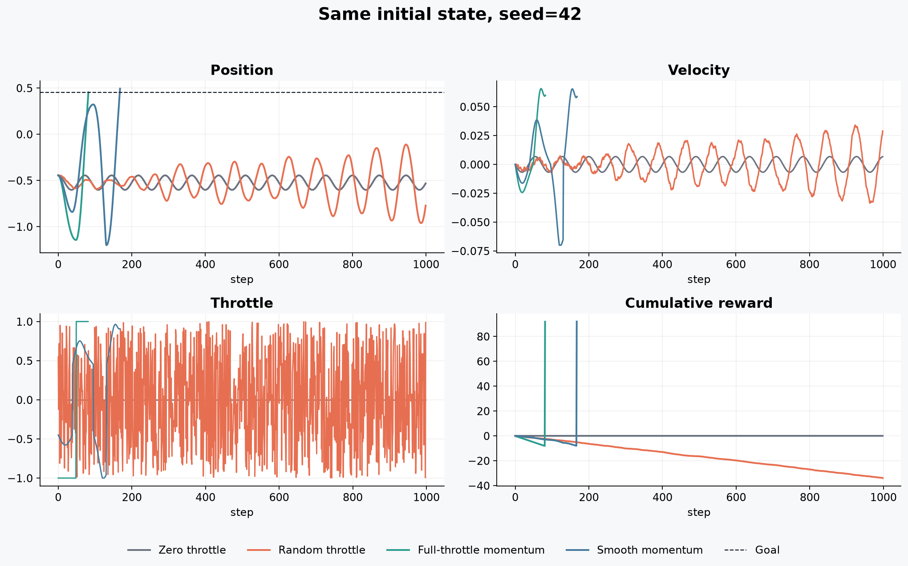

# RL强化学习从小白到老鸟（九）——油门不是开关：第一次走进连续动作空间

> 项目源码：<https://github.com/NocoldBob/RL>
>
> 第一篇：[速通贪吃蛇游戏](https://blog.csdn.net/bobwww123/article/details/138722671)
>
> 第二篇：[手撕 GPT（零基础保姆级教学）](https://blog.csdn.net/bobwww123/article/details/138948884)
>
> 第三篇：[让训练更稳定、更容易复现](https://blog.csdn.net/bobwww123/article/details/163925583)
>
> 第四篇：[DQN 实战：四种策略同场对照](https://blog.csdn.net/bobwww123/article/details/163925932)
>
> 第五篇：[PPO 实战：从单步更新到稳定策略优化](https://blog.csdn.net/bobwww123/article/details/163926240)
>
> 第六篇：[Double DQN 实战：降低 Q 值，成绩就会更好吗](https://blog.csdn.net/bobwww123/article/details/163937191)
>
> 第七篇：[Dueling DQN 实战：先判断局面，再选择动作](https://blog.csdn.net/bobwww123/article/details/163937626)
>
> 第八篇：[同一局面，六种模型会怎么走？](https://blog.csdn.net/bobwww123/article/details/164296013)



贪吃蛇只有三个动作：左转、右转、直行。模型最后要做的事情，是从三个编号中选出一个。

现实里的控制往往不是这样。踩油门可以踩一点，也可以踩到底；机械臂的关节角度、无人机的
推力和车辆的转向角，都不是几个固定按钮。

从这一篇开始，我们换一辆动力不足的小车，正式进入连续动作空间。

## 一、这辆车为什么要先往后开

使用的环境是 Gymnasium 自带的 `MountainCarContinuous-v0`：



小车停在山谷里，目标是开到右侧旗杆。它的发动机很弱，直接一直向右踩油门爬不上去，必须
先向左后退，借助下坡速度积累能量，再反向冲上右侧山坡。

状态只有两个数：

| 状态 | 范围 | 含义 |
|---|---:|---|
| `position` | `[-1.2, 0.6]` | 小车在山谷中的位置 |
| `velocity` | `[-0.07, 0.07]` | 当前速度和方向 |

和贪吃蛇的七通道网格相比，这个状态很小。但动作发生了根本变化：

```text
Box(-1.0, 1.0, (1,), float32)
```

动作不再是 `0、1、2`，而是一个 `[-1, 1]` 之间的浮点数：

- `-1`：全力向左；
- `0`：不给动力；
- `1`：全力向右；
- `0.37`：用 37% 左右的力度向右；
- `-0.62`：用 62% 左右的力度向左。

## 二、连续动作不是“多分几个档位”



离散动作可以枚举。三个动作就比较三个输出，哪个概率或 Q 值最高，就执行哪个。

连续区间里有无数个可能值，没法让网络给每一个油门值都单独输出一个 Q 值。后面训练 PPO
或 SAC 时，策略网络需要直接生成一个分布或一个连续数值，而不是给动作编号排名。

环境接收动作的代码反而很简单：

```python
env = gym.make("MountainCarContinuous-v0")
observation, info = env.reset(seed=42)

action = np.array([-0.6], dtype=np.float32)
next_observation, reward, terminated, truncated, info = env.step(action)
```

容易出错的是动作形状。这个环境要的是形如 `[-0.6]` 的一维数组，而不是 Python 标量
`-0.6`，也不是离散动作编号。

## 三、奖励里藏着油门成本

到达目标会得到 `+100` 奖励，每一步还会扣除：

```text
0.1 × action²
```

全油门一小步的成本是 `0.1`，半油门只有 `0.025`。正负方向的成本相同，因为计算的是平方。

这让任务不只是“能不能到”，还多了一层取舍：

- 油门大，可能更快到达；
- 油门小，单步更省，但可能需要更多时间；
- 完全不踩油门没有动作成本，却永远到不了终点。

所以这一篇会同时记录奖励、成功率、步数和累计动作成本。只看其中一个数字，很容易得出奇怪
结论。

## 四、先让四种简单策略试车

这次仍然不训练神经网络。先准备四个基线，把环境和评价方式摸清楚。

### 1. 零油门

每一步都输出 `0`。它不会浪费动力，也不会离开山谷。

### 2. 随机油门

每一步从 `[-1, 1]` 均匀随机采样。动作一直在变，但前后力量通常互相抵消。

### 3. 全油门惯性策略

速度向左就全力向左，速度向右就全力向右。初始速度为 0 时先向左：

```python
velocity = float(observation[1])
direction = 1.0 if velocity > 0.0 else -1.0
action = np.array([direction], dtype=np.float32)
```

这条规则听起来有点反直觉，却正好利用了山谷中的惯性。

### 4. 平滑惯性策略

方向与全油门策略相同，但速度较慢时只给一部分油门，随着速度增加再逐渐加大：

```python
normalized_speed = min(abs(velocity) / 0.07, 1.0)
throttle = 0.45 + 0.55 * normalized_speed
action = np.array([direction * throttle], dtype=np.float32)
```

它不是学习算法，只是一条人为规则。作用是给后面的连续策略提供一个“能成功、但并非最优”的
参照物。

## 五、实验怎样保持一致

四种策略分别运行 100 局，使用同一组初始种子 `2026` 到 `2125`。同一个种子会产生相同的
初始位置，因此四种策略面对的是配对起点。

每局最多 999 步，记录：

- 回合总奖励；
- 是否到达旗杆；
- 回合步数；
- 累计动作成本；
- 走到的最远位置。

另外使用 `seed=42` 保存四条完整轨迹，专门观察位置、速度、油门和累计奖励怎样变化。

运行命令：

```powershell
python .\连续控制\benchmark_baselines.py
```

一次运行会生成 JSON、CSV 和本文使用的五张图，不需要显卡，也没有训练过程。

## 六、100 局结果



| 策略 | 平均奖励 | 奖励标准差 | 成功率 | 平均步数 | 平均动作成本 |
|---|---:|---:|---:|---:|---:|
| 零油门 | `0.00` | `0.00` | `0%` | `999.00` | `0.00` |
| 随机油门 | `-31.27` | `14.59` | `2%` | `996.98` | `33.27` |
| 全油门惯性 | `92.06` | `0.20` | `100%` | `79.37` | `7.94` |
| 平滑惯性 | `93.88` | `1.47` | `100%` | `138.90` | `6.12` |

零油门的平均奖励是 `0`，看起来比随机油门的 `-31.27` 好，但它一局都没有成功。随机策略
不停耗费动作成本，偶尔碰巧积累出足够动量，100 局中只有 2 局到达终点。

两种惯性策略都达到 `100%` 成功率。全油门平均只用 79 步，是四种策略中最快的；平滑油门
平均需要 139 步，却把动作成本从 `7.94` 降到 `6.12`，最后平均奖励反而更高。

这里已经出现了连续控制里常见的权衡：更快、更省力和更高回报，未必由同一种控制方式同时
拿到。

## 七、同一个起点，轨迹差在哪里



`seed=42` 时：

| 策略 | 步数 | 回报 | 动作成本 | 最远位置 |
|---|---:|---:|---:|---:|
| 零油门 | `999` | `0.00` | `0.00` | `-0.45` |
| 随机油门 | `999` | `-33.96` | `33.96` | `-0.11` |
| 全油门惯性 | `82` | `91.80` | `8.20` | `0.45` |
| 平滑惯性 | `168` | `91.95` | `8.04` | `0.49` |

零油门的灰线只在谷底小幅摆动，累计奖励保持在 0。随机油门看起来很热闹，但速度方向频繁
被打断，直到 999 步也没碰到目标。

两种惯性策略的轨迹很有规律：先向左下冲，再借速度向右上冲。全油门只摆动一次就到达目标；
平滑策略前期力度小一些，需要多积累一轮能量。

规则代码只有几行，但轨迹已经把连续动作的三个特点摆在眼前：方向、力度和持续时间会共同
影响结果。

## 八、在本机播放四种策略

默认播放平滑惯性策略：

```powershell
python .\连续控制\play_baseline.py
```

也可以指定其他策略：

```powershell
python .\连续控制\play_baseline.py zero
python .\连续控制\play_baseline.py random
python .\连续控制\play_baseline.py bang_bang
python .\连续控制\play_baseline.py smooth_momentum
```

窗口运行太快时可以调低帧率：

```powershell
python .\连续控制\play_baseline.py smooth_momentum --fps 15
```

## 九、下一步才轮到模型学习

这一篇没有训练模型，原因和当初先写贪吃蛇环境一样：先确认动作、奖励、终止条件和基线，再
加入算法。否则训练曲线出了问题，很难判断是策略网络没学会，还是我们根本没理解环境。

现在已经有了两个可以达到 `100%` 成功率的规则基线。下一篇会把之前的 PPO 改成连续版本，
让网络直接学习油门分布，再用同一组起点和同一套指标与这些规则比较。
