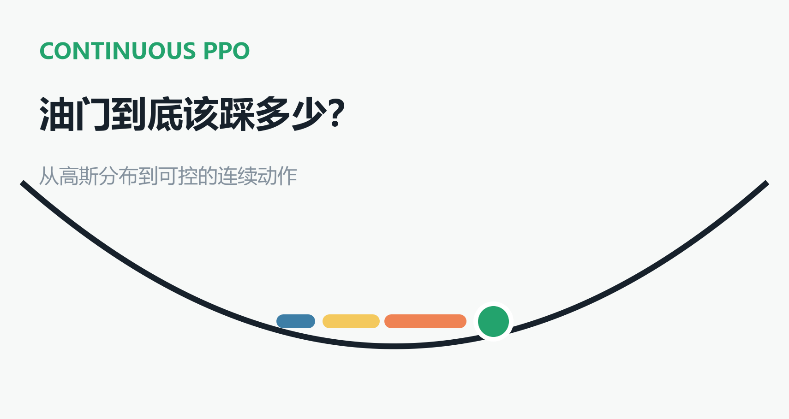
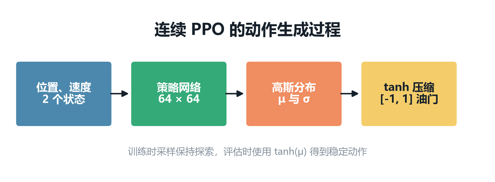
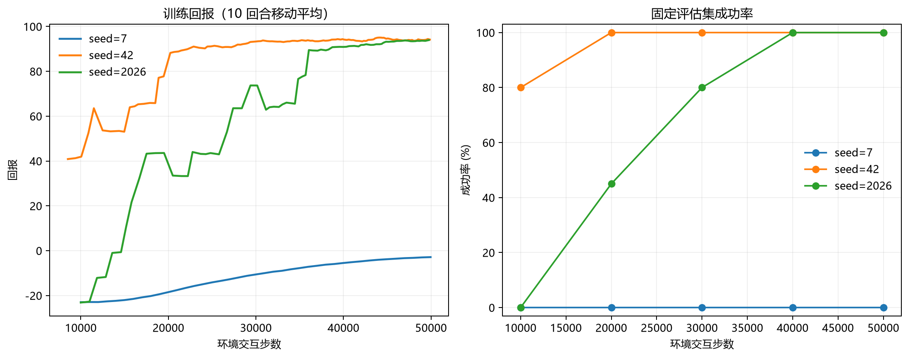
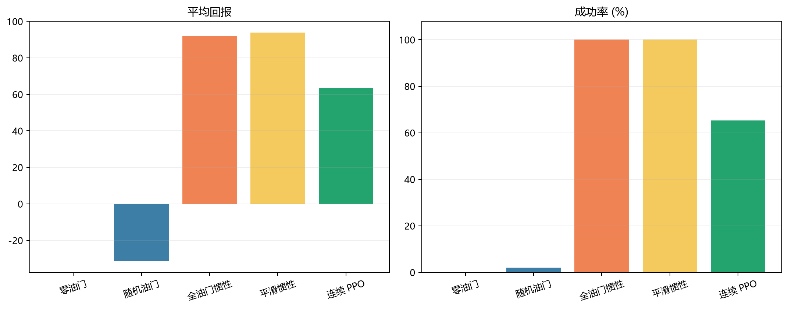
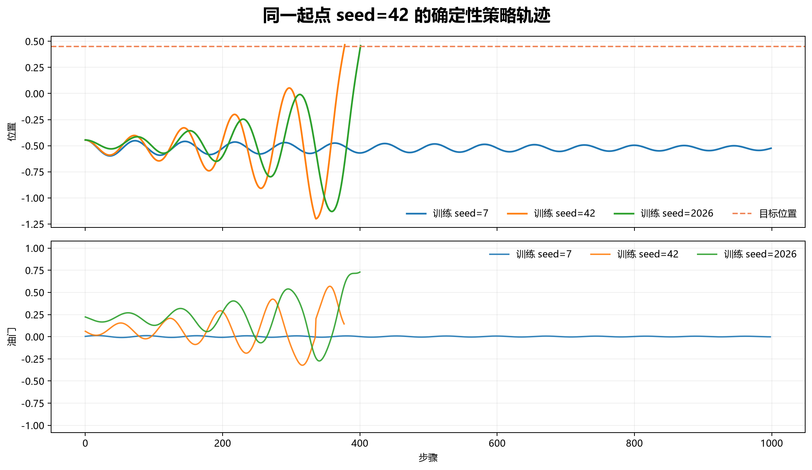

# RL强化学习从小白到老鸟（十）——油门到底该踩多少？用 PPO 学会连续控制

> 项目源码：<https://github.com/NocoldBob/RL>
>
> 第一篇：[速通贪吃蛇游戏](https://blog.csdn.net/bobwww123/article/details/138722671)
>
> 第二篇：[手撕 GPT（零基础保姆级教学）](https://blog.csdn.net/bobwww123/article/details/138948884)
>
> 第三篇：[让训练更稳定、更容易复现](https://blog.csdn.net/bobwww123/article/details/163925583)
>
> 第四篇：[DQN 实战：四种策略同场对照](https://blog.csdn.net/bobwww123/article/details/163925932)
>
> 第五篇：[PPO 实战：从单步更新到稳定策略优化](https://blog.csdn.net/bobwww123/article/details/163926240)
>
> 第六篇：[Double DQN 实战：降低 Q 值，成绩就会更好吗](https://blog.csdn.net/bobwww123/article/details/163937191)
>
> 第七篇：[Dueling DQN 实战：先判断局面，再选择动作](https://blog.csdn.net/bobwww123/article/details/163937626)
>
> 第八篇：[同一局面，六种模型会怎么走？](https://blog.csdn.net/bobwww123/article/details/164296013)
>
> 第九篇：[油门不是开关：第一次走进连续动作空间](https://blog.csdn.net/bobwww123/article/details/164314437)



上一篇把贪吃蛇换成了连续山地车。动作不再是左、中、右三个选项，而是 `[-1, 1]` 之间的
任意油门值。

四条手写规则已经证明：这辆小车必须先后退积累动量，再掉头冲上右坡。现在把规则收起来，
让 PPO 自己学。问题也随之而来：原来的 PPO 只会从几个动作中挑一个，怎样才能让它输出
`0.37` 或 `-0.62` 这样的连续动作？

## 一、离散 PPO 为什么不能直接拿来用

第五篇里的策略网络输出三个 logits，再构造分类分布：

```python
distribution = torch.distributions.Categorical(logits=logits)
action = distribution.sample()
```

连续区间无法枚举，所以这次网络不再为每个动作打分，而是输出一个高斯分布。网络给出均值
`μ`，另有一个可学习参数表示标准差 `σ`：

- `μ` 决定当前更想往哪边、踩多大；
- `σ` 决定动作有多随机，也就是探索强度；
- 训练时从分布采样，评估时直接使用均值。



网络很小，两层各 64 个神经元。输入仍然只有位置和速度，Actor 输出动作分布，Critic 输出
状态价值。位置与速度的原始量纲不同，输入网络前先把它们缩放到大约 `[-1, 1]`：

```python
midpoint = (observation_low + observation_high) / 2
half_range = (observation_high - observation_low) / 2
normalized = (observation - midpoint) / half_range
```

## 二、高斯分布会踩出界

普通高斯分布的范围是负无穷到正无穷，直接采样可能得到 `1.4`，但环境只接受
`[-1, 1]`。简单裁剪虽然能运行，却会把所有越界样本堆在 `-1` 和 `1` 两端，实际动作与
用于 PPO 更新的概率也对不上。

这里使用 `tanh` 压缩：

```python
raw_action = distribution.rsample()
action = torch.tanh(raw_action)
```

无论 `raw_action` 多大，`tanh` 的输出都不会越界。不过，数值被压缩后概率密度也发生了
变化。PPO 计算新旧策略概率比时，必须补上变量变换的修正项：

```python
log_prob = distribution.log_prob(raw_action).sum(-1)
correction = torch.log(1 - action.square() + 1e-6).sum(-1)
log_prob = log_prob - correction
```

少掉这一项，程序通常不会报错，损失也照样变化，但 PPO 使用的并不是实际执行动作的正确
概率。这类错误比语法错误麻烦得多，因此代码中专门加入了“采样概率与重新计算概率一致”的
测试。

## 三、截断不是自然终止

Gymnasium 把一局结束分成两种：

- `terminated=True`：小车到达目标，任务自然结束；
- `truncated=True`：跑满 999 步，被时间上限截断。

计算 GAE 时，两者不能完全混用。自然终止后的下一状态价值是 0；时间截断不是环境中的吸收
状态，TD 目标仍应使用 Critic 对最后状态的估值。但无论哪一种，一旦重置环境，GAE 都不能
串到下一局。

代码因此同时保存两个标记：

```python
bootstrap = 1.0 - terminated
delta = reward + gamma * bootstrap * next_value - value

continue_episode = 1.0 - episode_done
gae = delta + gamma * gae_lambda * continue_episode * gae
```

第一行决定是否自举，第二行决定是否继续向前传播优势。看上去只差一个布尔值，却直接影响
失败回合的价值学习。

## 四、这次怎样训练

三个训练种子仍使用 `7、42、2026`，每个种子与环境交互 5 万步。主要参数如下：

| 参数 | 数值 |
|---|---:|
| Rollout 长度 | `2048` |
| PPO 更新轮数 | `10` |
| Minibatch | `64` |
| 学习率 | `3e-4` |
| 折扣因子 | `0.99` |
| GAE Lambda | `0.95` |
| 裁剪范围 | `0.2` |
| 训练奖励缩放 | `0.01` |

奖励缩放只用于稳定 Critic 的数值，不改变奖励各部分的相对关系。最终评估仍使用环境给出的
原始奖励。

每 1 万步在一组固定但独立的起点上评估一次，用于保存最佳检查点。训练结束后，再用上一篇
完全相同的 100 个种子 `2026` 到 `2125` 做最终测试。选择模型和最终考试没有共用起点。

完整实验命令：

```powershell
python .\连续控制\benchmark_continuous_ppo.py
```

## 五、三次训练，两种结果



`seed=42` 很快找到有效轨迹，2 万步时评估成功率已经达到 100%。`seed=2026` 起步较慢，
到 4 万步才稳定成功。

`seed=7` 完全不同。它早期没有碰到终点，只看见“踩油门会扣分”，最后学出的办法是几乎
不踩油门。回报逐渐接近 0，但成功率始终是 0。

我额外试过增大初始动作标准差，也试过加入很小的熵奖励，失败种子仍会回到零油门附近。
这不是换一个超参数就一定能消失的问题，而是稀疏奖励里的典型局部最优：到达终点的
`+100` 很远，每一步动作成本却立刻可见。

只展示 `seed=42`，我们会得到一条非常漂亮的结论；保留三个种子，结论才接近真实情况。

## 六、和手写规则放在一起



先看三个 PPO 模型各自的 100 局结果：

| 训练种子 | 平均回报 | 成功率 | 平均步数 | 成功局平均步数 | 平均动作成本 |
|---:|---:|---:|---:|---:|---:|
| `7` | `-0.002` | `0%` | `999.00` | - | `0.002` |
| `42` | `94.21` | `96%` | `482.06` | `460.52` | `1.79` |
| `2026` | `96.16` | `100%` | `396.06` | `396.06` | `3.84` |
| 三种子平均 | `63.46` | `65.33%` | `625.71` | `428.29` | `1.88` |

再对照上一篇的两条成功规则：

| 策略 | 平均回报 | 成功率 | 平均步数 | 平均动作成本 |
|---|---:|---:|---:|---:|
| 全油门惯性 | `92.06` | `100%` | `79.37` | `7.94` |
| 平滑惯性 | `93.88` | `100%` | `138.90` | `6.12` |

手写规则更可靠，也快得多。成功的 PPO 模型则学会了更轻柔的控制：`seed=2026` 平均动作
成本只有 `3.84`，`seed=42` 更低到 `1.79`。它们虽然走得慢，却因为省油拿到了比全油门
规则更高的回报。

所以不能只说“PPO 打败了规则”或者“规则打败了 PPO”。这里至少有三件事同时成立：

1. 手写规则成功率高、到达速度快；
2. 学成功的 PPO 动作成本更低；
3. 当前 PPO 对随机种子敏感，可靠性还不够。

## 七、模型到底学会了什么动作



同样从 `seed=42` 的位置出发，两个成功模型都会随着摆动逐渐增加油门，方向也跟着速度和
位置变化。它们没有复刻“速度向哪边就全力踩哪边”的规则，而是学出幅度不同的连续控制。

失败模型的轨迹则一直停在谷底附近，油门几乎贴着 0。它的 Critic 和策略并非没有更新，
只是它优化成了一个对失败局来说很合理、对完成任务来说毫无用处的答案。

播放训练好的模型：

```powershell
python .\连续控制\play_continuous_ppo.py `
  .\runs\continuous-ppo\seed-42\checkpoints\best.pt
```

也可以把路径中的 `seed-42` 换成 `seed-7` 或 `seed-2026`，亲眼看看成功策略和零油门策略
的区别。

## 八、这一版 PPO 还缺什么

这次没有给环境增加人工塑形奖励，也没有让模型模仿惯性规则。这样做保留了一个干净的
实验：只把离散 PPO 改成连续策略后，它确实能学会，但并不稳定。

接下来引入 SAC 会更有针对性。PPO 收集一批数据后就丢弃，而 SAC 会把经历保存在经验回放
中反复使用；它还会主动调节策略随机性，并用两个 Q 网络降低价值高估。到时仍用这三个训练
种子和同一批 100 个测试起点，看看换成离策略算法后，`seed=7` 这种失败是否会减少。
